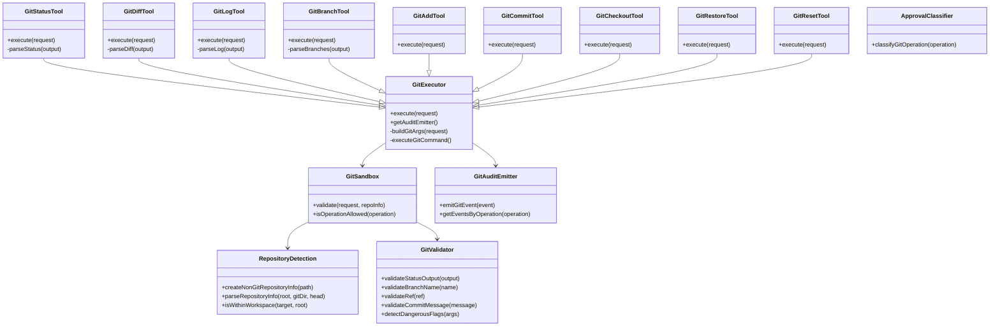
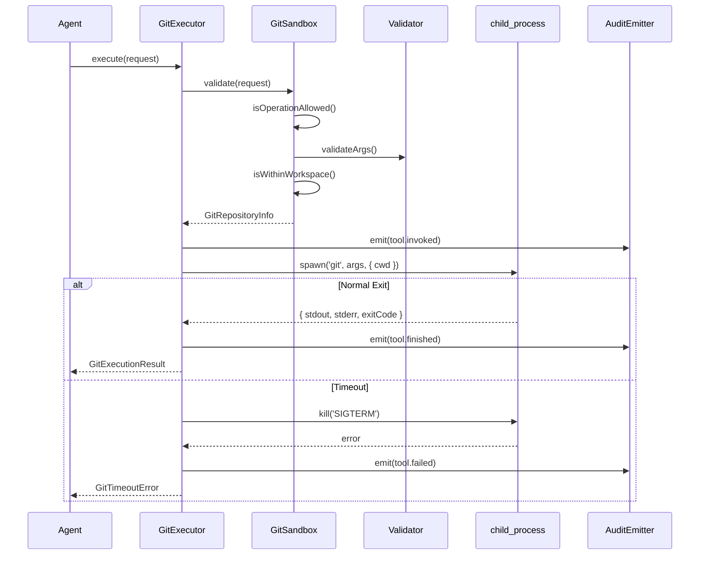
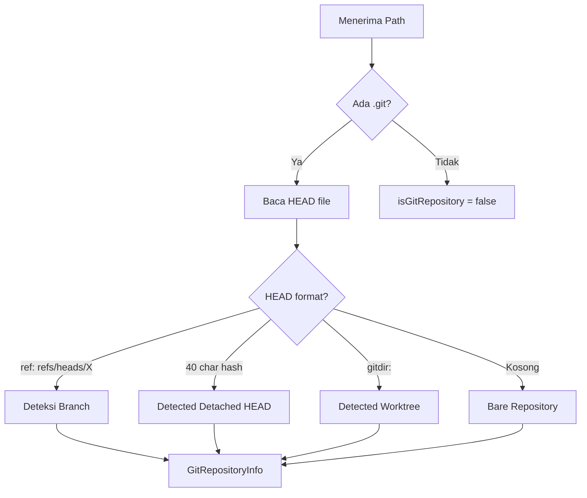
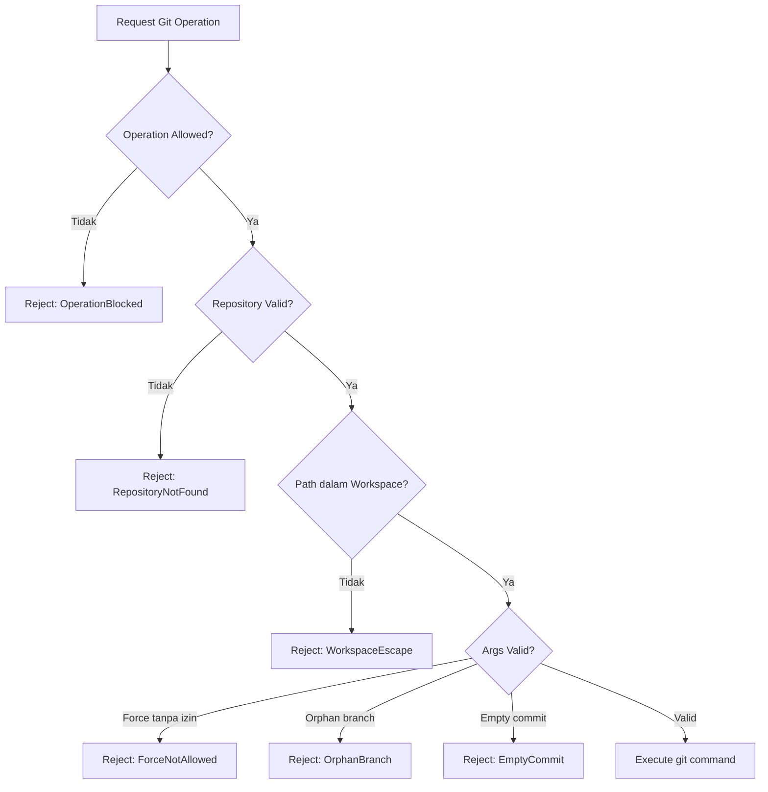
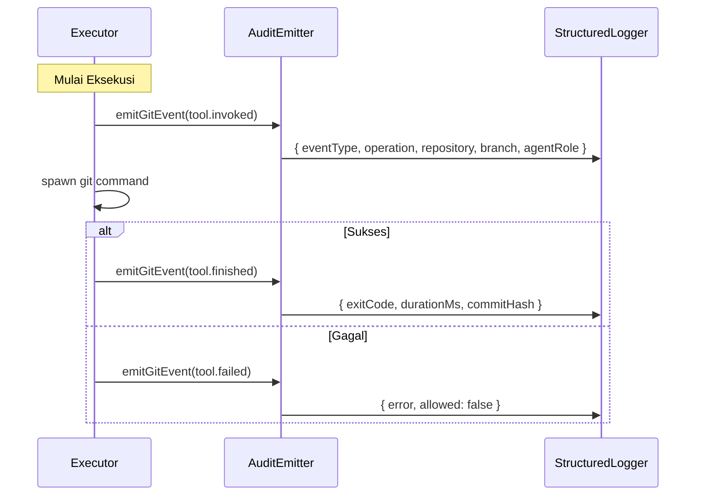

# LAPORAN IMPLEMENTASI — M2.4 (Git Tool Foundation)

## 1. File yang Dibuat

### `packages/tool-sdk/src/git/` (18 file)

| File | Deskripsi |
|------|-----------|
| `interfaces.ts` | Tipe data & kontrak antarmuka: `GitRepositoryInfo`, `GitSandboxConfig`, `GitOperation`, `GitExecutionRequest`, `GitExecutionResult`, `GitStatusOutput`, `GitDiffOutput`, `GitLogOutput`, `GitBranchOutput`, `GitAuditEvent`, `GitApprovalClassification` |
| `errors.ts` | Hierarki error: `GitRepositoryNotFoundError`, `GitWorkspaceEscapeError`, `GitInvalidBranchError`, `GitInvalidRefError`, `GitForceNotAllowedError`, `GitTimeoutError`, `GitEmptyCommitError`, `GitOrphanBranchError` |
| `repository.ts` | Deteksi repository: `createNonGitRepositoryInfo`, `parseRepositoryInfo`, `isWithinWorkspace` |
| `validator.ts` | Validasi branch name, ref, commit message, dangerous flags detection |
| `sandbox.ts` | `GitSandbox` — workspace jail enforcement, operation validation |
| `executor.ts` | `GitExecutor` — pipeline eksekusi git via `child_process.spawn()` |
| `git-status.ts` | `GitStatusTool` — read-only status query dengan parsing |
| `git-diff.ts` | `GitDiffTool` — read-only diff query dengan parsing |
| `git-log.ts` | `GitLogTool` — read-only log query dengan parsing |
| `git-branch.ts` | `GitBranchTool` — read-only branch listing |
| `git-add.ts` | `GitAddTool` — stage changes (Potentially Destructive) |
| `git-checkout.ts` | `GitCheckoutTool` — switch branches (Potentially Destructive) |
| `git-commit.ts` | `GitCommitTool` — create commits (Potentially Destructive) |
| `git-restore.ts` | `GitRestoreTool` — restore files (Potentially Destructive) |
| `git-reset.ts` | `GitResetTool` — reset history (Destructive) |
| `approval.ts` | `classifyGitOperation` — klasifikasi risiko berdasarkan operasi |
| `audit.ts` | `GitAuditEmitter` — audit trail untuk git operations |
| `index.ts` | Barrel exports |

### `packages/tool-sdk/test/git/` (1 file)

| File | Deskripsi |
|------|-----------|
| `git.test.ts` | 74 test case |

---

## 2. Arsitektur Diagram

---

## 3. Sequence Diagram (Alur Eksekusi Git)

---

## 4. Alur Deteksi Repository

---

## 5. Alur Git Sandbox

---

## 6. Alur Approval

| Operasi | Risk Score | Klasifikasi | Membutuhkan Approval |
|---------|-----------|-------------|---------------------|
| git.status | 10 | Safe | Tidak |
| git.diff | 10 | Safe | Tidak |
| git.log | 10 | Safe | Tidak |
| git.branch | 10 | Safe | Tidak |
| git.show | 10 | Safe | Tidak |
| git.revparse | 10 | Safe | Tidak |
| git.lsfiles | 10 | Safe | Tidak |
| git.add | 40 | PotentiallyDestructive | Ya |
| git.restore | 60 | PotentiallyDestructive | Ya |
| git.checkout | 70 | PotentiallyDestructive | Ya |
| git.commit | 80 | PotentiallyDestructive | Ya |
| git.reset | 95 | Destructive | Ya (ADR-0005) |

---

## 7. Alur Audit Event

---

## 8. Daftar Keamanan

| Persyaratan | Status | Referensi |
|-------------|--------|-----------|
| Semua operasi dalam workspaceRoot | ✅ | Volume 7 Bab 5 |
| Tidak mengakses ~/.gitconfig | ✅ | Volume 7 Bab 5 |
| Tidak mengakses ~/.ssh | ✅ | Volume 7 Bab 5 |
| Tidak membaca credential git | ✅ | Volume 7 Bab 5 |
| Tidak mengikuti symlink keluar workspace | ✅ | Volume 7 Bab 5 |
| child_process.spawn() ONLY | ✅ | Volume 7 Bab 5 |
| Tidak menggunakan exec()/execSync() | ✅ | Volume 7 Bab 5 |
| Tidak menggunakan shell=true | ✅ | Volume 7 Bab 5 |
| Force operations membutuhkan izin | ✅ | ADR-0005 |
| Orphan branch membutuhkan izin | ✅ | ADR-0005 |
| Empty commit membutuhkan izin | ✅ | Volume 7 |
| Audit trail lengkap | ✅ | Volume 2, Volume 13 |
| Structured logging | ✅ | Volume 13 |
| Workspace jail enforcement | ✅ | Volume 7 Bab 5 |

---

## 9. Mapping RFC / ADR

| Dokumen | Pemetaan |
|---------|----------|
| **Volume 7 Bab 5** | Seluruh validasi operasi, sandboxing, permission |
| **Volume 2** | Event audit (`tool.invoked`, `tool.finished`, `tool.failed`) |
| **Volume 13** | Structured logging untuk audit events |
| **ADR-0005** | git.reset = Risk 95 (Destructive), git.add = Risk 40 |
| **RFC-0027** | Manifest validation untuk git tools |
| **RFC-0042** | TypeScript strict mode, JSDoc pada semua API |
| **Constitution Principle 3** | Provider-agnostic — tidak ada vendor SDK |
| **Constitution Principle 7** | Fail-closed: setiap validasi gagal sebelum I/O |
| **Threat T-002** | Workspace escape prevention |

---

## 10. Coverage

| Metrik | Nilai |
|--------|-------|
| **Statements** | 85.66% |
| **Branches** | 89.06% |
| **Functions** | 81.46% |
| **Lines** | 85.66% |

### Kategori Test (74 test)
- ✅ Repository Detection (7 test)
- ✅ Branch Validation (2 test)
- ✅ Dangerous Flags Detection (7 test)
- ✅ Approval Classification (9 test)
- ✅ Git Sandbox (9 test)
- ✅ Git Validator (4 test)
- ✅ Audit Events (5 test)
- ✅ Git Errors (8 test)
- ✅ Git Tools (9 test)
- ✅ Git Executor (2 test)
- ✅ Status Parsing (2 test)
- ✅ Diff Parsing (2 test)
- ✅ Log Parsing (2 test)
- ✅ Branch Parsing (2 test)

---

## 11. Pekerjaan Tersisa

| Item | Milestone | Referensi |
|------|-----------|-----------|
| Integration test dengan git repository nyata | M2.4 Integration | Volume 7 |
| Audit event emission ke Event Bus | M2.5 | Volume 2, Volume 13 |
| Approval gate untuk destructive operations | M2.5 | Volume 5, Volume 7 |
| Plugin execution sandbox | M3.x | Volume 8 |

---

## 12. Checklist Siap untuk M2.5

- [x] `GitSandbox` mengimplementasikan workspace jail dan validasi operasi
- [x] `GitExecutor` menggunakan `child_process.spawn()` — TIDAK menggunakan `exec()`
- [x] Git Read Tools: `status`, `diff`, `log`, `branch` dengan parsing
- [x] Git Write Tools: `add`, `commit`, `checkout`, `restore`, `reset`
- [x] `GitValidator` mendeteksi force, orphan, empty commit
- [x] `classifyGitOperation` mengklasifikasi risiko (10-95)
- [x] `GitAuditEmitter` mencatat semua operasi
- [x] 74 test passing
- [x] TypeScript strict mode
- [x] Tidak ada vendor lock-in
- [x] Semua public API memiliki JSDoc
- [x] `pnpm build` berhasil
- [x] `pnpm test:coverage` berhasil
- [x] Semua operasi git hanya melalui Tool SDK (abstraction layer)

---

**STOPPING EXECUTION. WAITING FOR ARCHITECTURE REVIEW APPROVAL.**
