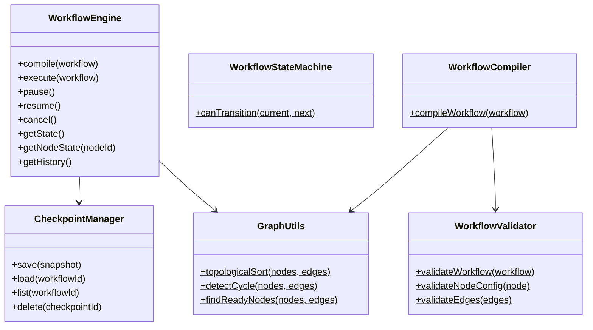
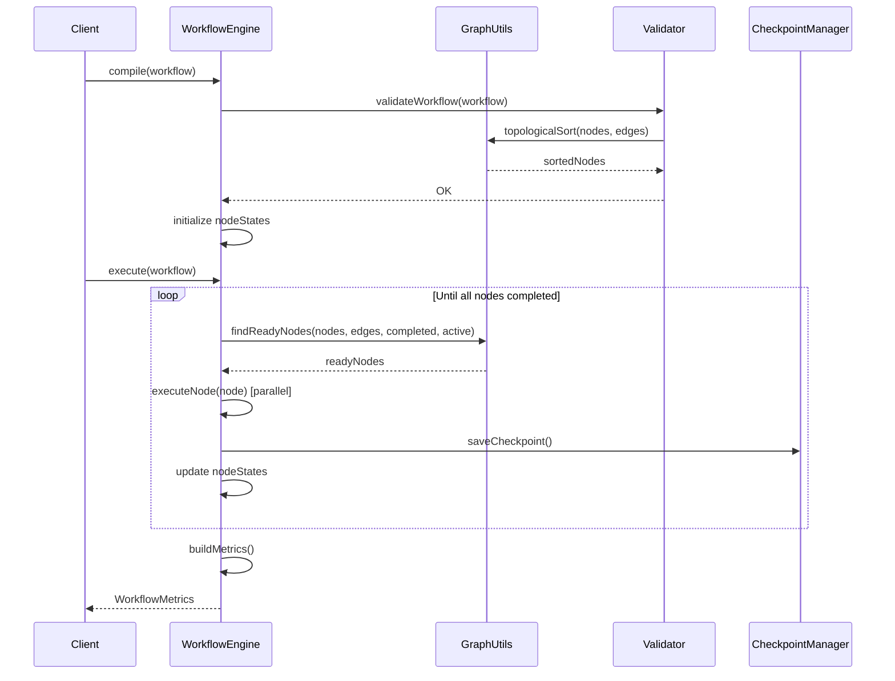
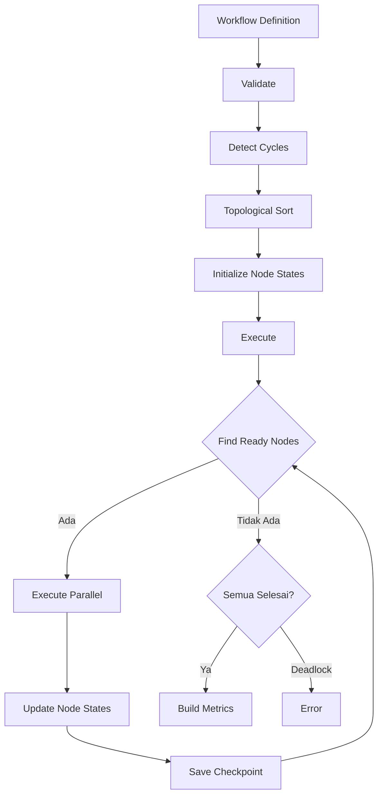

# LAPORAN IMPLEMENTASI — M3.1 (Workflow Engine)

## 1. File yang Dibuat

### `packages/workflow-engine/src/` (7 file)

| File | Deskripsi |
|------|-----------|
| `interfaces.ts` | Tipe data: `WorkflowDefinition`, `WorkflowNode`, `WorkflowEdge`, `WorkflowState`, `NodeState`, `NodeType`, `ExecutionSnapshot`, `Checkpoint`, `ExecutionHistoryEntry`, `WorkflowMetrics` |
| `errors.ts` | Hierarki error: `CycleDetectedError`, `DeadlockDetectedError`, `NodeNotFoundError`, `WorkflowExecutionError`, `WorkflowTimeoutError`, `SnapshotError`, `ResumeError` |
| `graph.ts` | Utility graf: `topologicalSort`, `detectCycle`, `getPredecessors`, `getSuccessors`, `isNodeReady`, `findReadyNodes` |
| `validator.ts` | Validasi workflow: `validateWorkflow`, `validateNodeConfig`, `validateEdges` |
| `checkpoint.ts` | `InMemoryCheckpointManager`, `createSnapshot`, `restoreFromSnapshot` |
| `engine.ts` | `WorkflowEngine` — mesin eksekusi utama, `WorkflowStateMachine` |
| `compiler.ts` | `compileWorkflow` — kompilasi workflow definition ke executable form |
| `serializer.ts` | `JsonWorkflowSerializer` — serialisasi/deserialisasi workflow |
| `index.ts` | Barrel exports |

### `packages/workflow-engine/test/` (1 file)

| File | Deskripsi |
|------|-----------|
| `workflow.test.ts` | 32 test case |

---

## 2. Arsitektur Diagram

---

## 3. Sequence Diagram (Eksekusi Workflow)

---

## 4. Alur Task Decomposition

---

## 5. Security Checklist

| Persyaratan | Status | Referensi |
|-------------|--------|-----------|
| Cycle detection sebelum eksekusi | ✅ | Volume 5 |
| Deadlock detection | ✅ | Volume 5 |
| State machine validation | ✅ | Volume 2, Volume 5 |
| Checkpoint persistence | ✅ | Volume 5 |
| Snapshot immutability | ✅ | Volume 5 |
| Node state tracking | ✅ | Volume 5 |
| Execution history | ✅ | Volume 5, Volume 13 |
| Error propagation | ✅ | Volume 5 |
| Fail-closed validation | ✅ | Constitution Principle 7 |

---

## 6. Coverage

| Metrik | Nilai |
|--------|-------|
| **Statements** | 92.94% |
| **Branches** | 79.16% |
| **Functions** | 80.85% |
| **Lines** | 92.94% |

### Kategori Test (32 test)
- ✅ Graph Utilities (8 test)
- ✅ Validator (4 test)
- ✅ Checkpoint Manager (4 test)
- ✅ Workflow State Machine (1 test)
- ✅ Workflow Engine (8 test)
- ✅ Compiler (2 test)
- ✅ Serializer (3 test)

---

## 7. Mapping RFC / ADR

| Dokumen | Pemetaan |
|---------|----------|
| **Volume 5** | Seluruh DAG execution, approval gates, dependency scheduling |
| **Volume 2** | State machine patterns, event integration |
| **RFC-0008** | TaskContext retrieval (integrated with workflow) |
| **RFC-0038** | Task graph rollback (manual recovery mode) |
| **RFC-0042** | TypeScript strict mode, JSDoc |
| **Constitution Principle 7** | Fail-closed validation |

---

## 8. Pekerjaan Tersisa

| Item | Milestone | Referensi |
|------|-----------|-----------|
| Persistent checkpoint store (PostgreSQL) | M3.1.1 | Volume 6 |
| Approval gate integration with Tool SDK | M3.1.2 | Volume 7, M2.5 |
| Agent execution delegation | M3.1.3 | Volume 3, M3.0 |
| Event Bus emission for all state changes | M3.1.4 | Volume 2 |
| Advanced retry strategies | M3.1.5 | RFC-0038 |

---

## 9. Checklist Siap untuk M3.2

- [x] `WorkflowEngine` — compile, execute, pause, resume, cancel
- [x] `WorkflowStateMachine` — state transition validation
- [x] `GraphUtils` — topological sort, cycle detection, ready node detection
- [x] `WorkflowValidator` — workflow, node, and edge validation
- [x] `CheckpointManager` — save, load, list, delete checkpoints
- [x] `WorkflowCompiler` — compile workflow to executable form
- [x] `JsonWorkflowSerializer` — serialize/deserialize workflows
- [x] 32 test passing
- [x] TypeScript strict mode
- [x] `pnpm build` berhasil
- [x] `pnpm test:coverage` berhasil

---

**STOPPING EXECUTION. WAITING FOR ARCHITECTURE REVIEW APPROVAL.**
