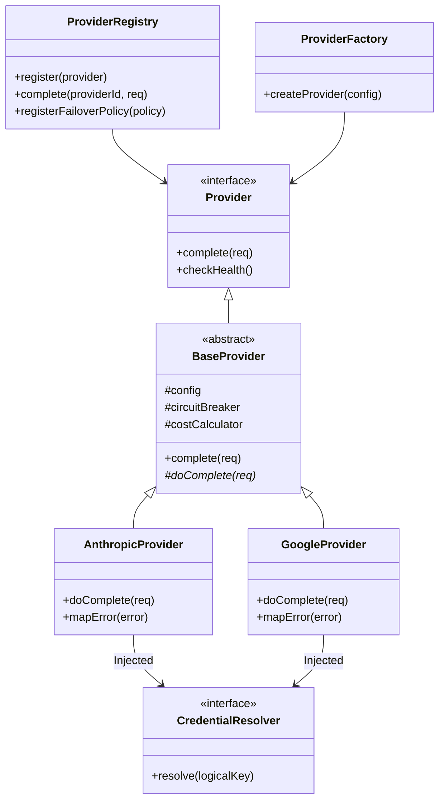
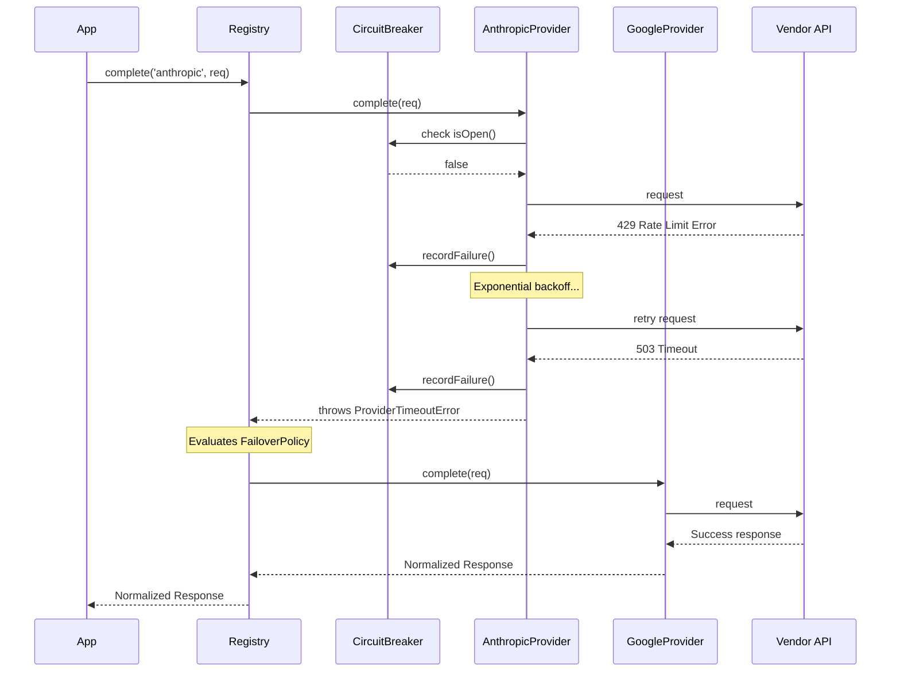

# Provider SDK (M1.2)
**Date:** 2026-07-14
**Status:** Completed

## 1. Architecture Diagram

## 2. Sequence Diagram (Retry & Failover)

## 3. Resilience Flow
The implementation supports robust fault-tolerance:
- **Exponential Backoff Retry**: Managed uniformly in `executeWithRetry`. Includes jitter `(±10%)`. Configurable `maxAttempts`, `initialDelayMs`, and `backoffMultiplier`.
- **Circuit Breaker**: Half-open states supported. `recordFailure()` tracks continuous drops; resets asynchronously via `resetTimeoutMs`. `CircuitBreakerOpenError` thrown aggressively.
- **Provider Failover**: A declarative `ProviderFailoverPolicy` instructs `ProviderRegistry` to catch specific exceptions (`timeout`, `rate_limit`, `error`) and gracefully delegate request handling to a predefined secondary.

## 4. Credential Flow
- Adhering to the mandated Dependency Inversion Principle, no part of this module has dependencies on `process.env` or `@agentx/secrets` backend directly.
- The `ProviderFactory` accepts a `CredentialResolver` interface.
- Adapters (Anthropic, Google) asynchronously request keys: `await this.credentialResolver.resolve('provider.anthropic.api_key')`.

## 5. Reference Mapping
- **Volume 4 (Provider Platform):** Strict compliance implementing normalization, usage tracking, and the core capability interface.
- **ADR-0003 (Two Adapters v0.1):** `AnthropicProvider` and `GoogleProvider` developed.
- **Constitution Principle 3:** Vendor SDK isolation met—only referenced internally in `packages/provider-sdk/src/providers/*`.
- **API Standards:** Common `ProviderError` hierarchies adopted mapping closely to REST specifications.
