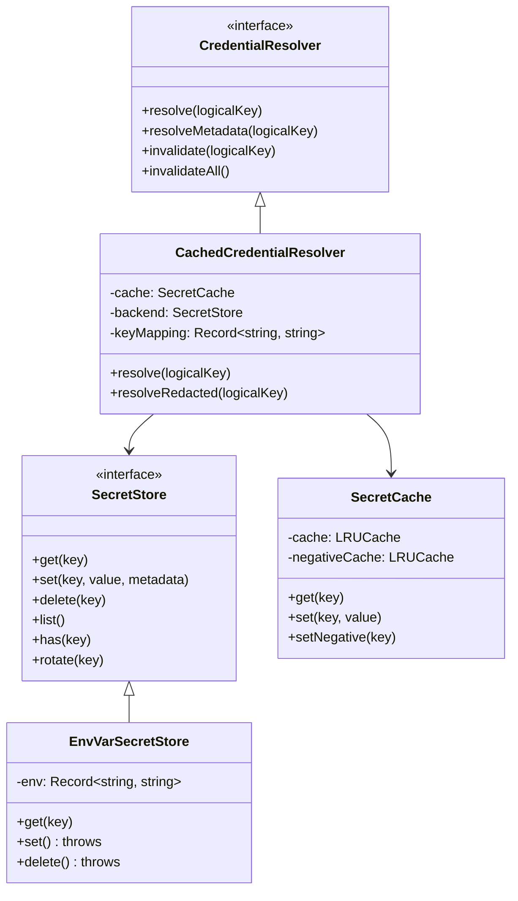
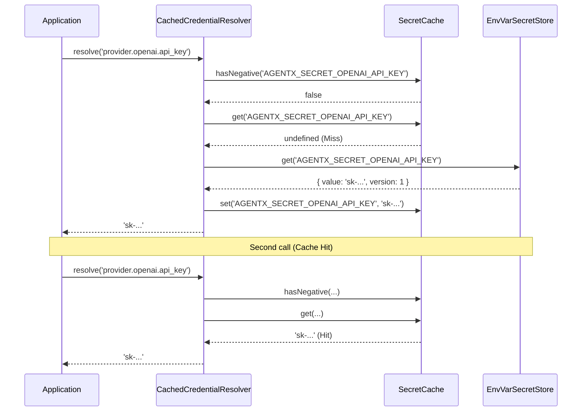

# Secrets & Key Management (M1.1)
**Date:** 2026-07-14
**Status:** Completed

## 1. Component Diagram

## 2. Sequence Diagram (Cache Hit & Miss)

## 3. Class Relationships & Core Abstractions

- `EnvVarSecretStore`: Implements the `SecretStore` contract. For v0.1, it reads from `process.env`. Mutation operations (`set`, `delete`, `rotate`) immediately throw `OperationNotSupportedError` preserving immutability at runtime.
- `CachedCredentialResolver`: Wraps any `SecretStore` implementation, providing LRU caching (5-minute TTL default) and negative caching (5-second TTL) to prevent thundering herd on missing keys. It maps logical keys (`provider.openai.api_key`) to physical backend keys (`AGENTX_SECRET_OPENAI_API_KEY`).
- `RedactedString`: A security primitive wrapper. Any attempt to serialize (`JSON.stringify()`) or cast it to a string (`toString()`, `valueOf()`) yields `"[REDACTED]"`.

## 4. Security Considerations
- **No-Logging Guarantee:** Any variable initialized via `CredentialResolver` should be wrapped in `RedactedString` if it leaves the boundary, mitigating accidental leaks in error traces or console logs (RFC-0023).
- **Environment Scrubbing:** The `scrubEnvironment(env)` utility produces a safe copy of process environment variables, actively stripping any key matching the `AGENTX_SECRET_*` prefix, effectively protecting child processes (e.g. `shell.exec` tool invocations) from scraping credentials (T-002).
- **Fail Closed:** Missing credentials do not default to empty strings or bypass workflows. They aggressively throw `CredentialResolutionError` immediately, ceasing operation.

## 5. Reference Mapping
- **Volume 16 (Secrets & Key Management):** Interfaces implemented exactly as specified.
- **RFC-0022 (Secrets Storage):** Architecture abstracted to `SecretStore` interface; `EnvVarBackend` implements v0.1 specification.
- **RFC-0023 (Credential Runtime Contract):** 5-min TTL LRU cache, no-logging wrappers, explicit error classes implemented.
- **ADR-0012 (Secrets v0.1 Mechanism):** Implemented `process.env` resolution keyed on `AGENTX_SECRET_{PROVIDER}_{KEY}`.
- **Threat Model T-002:** Addressed by the `scrubEnvironment` method.

## 6. Public API Documentation
The library exposes the following under `@agentx/secrets`:
- **Interfaces:** `SecretStore`, `SecretEntry`, `SecretMetadata`, `CredentialResolver`, `SecretCategory`, `Classification`.
- **Classes:** `CachedCredentialResolver`, `EnvVarSecretStore`, `SecretCache`, `RedactedString`.
- **Errors:** `SecretError`, `OperationNotSupportedError`, `SecretAccessError`, `SecretNotFoundError`, `CredentialResolutionError`.
- **Utilities:** `scrubEnvironment`.
