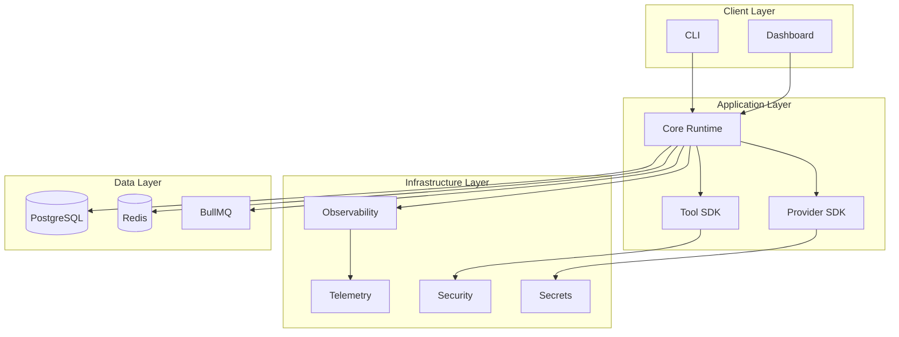

# Architecture Overview

## System Architecture

## Core Components

### Core Runtime (`@agentx/core-runtime`)

- **Scheduler** — Task queue management with concurrency limits
- **State Machine** — Task lifecycle transitions (CREATED → QUEUED → RUNNING → COMPLETED/FAILED)
- **Event Bus** — In-memory and BullMQ-backed event publishing
- **Cancellation** — Token-based cancellation with parent/child propagation
- **Retry** — Exponential/linear/constant backoff with max attempts

### Provider SDK (`@agentx/provider-sdk`)

- **Base Provider** — Abstract provider with circuit breaker, retry, timeout
- **Cost Calculator** — Token usage tracking and cost estimation
- **Health Check** — Provider availability monitoring

### Tool SDK (`@agentx/tool-sdk`)

- **Sandbox** — Filesystem and shell sandboxing
- **Approval Gates** — Human-in-the-loop approval workflow
- **Pipeline** — Pre/post/error hook execution pipeline
- **Permissions** — Role-based access control for tools

### Observability (`@agentx/observability`)

- **Tracer** — OpenTelemetry distributed tracing
- **Metrics** — Counter, histogram, gauge
- **Logger** — Structured JSON logging with trace context
- **Exporters** — OTLP trace export configuration

### Telemetry (`@agentx/telemetry`)

- **Aggregator** — Metrics computation (cost, latency, error rate)
- **Alert Engine** — Rule-based alerting with Slack/Email/Webhook
- **API** — Unified telemetry API with subscribe/unsubscribe

### Security (`@agentx/security`)

- **SAST Scanner** — Static analysis for common vulnerabilities
- **Secret Detector** — Pattern-based secret detection (AWS, GitHub, etc.)
- **Audit Log** — Hash-chained tamper-proof audit trail

## Data Flow

1. Client submits task via CLI or Dashboard
2. Core Runtime schedules task, transitions to QUEUED
3. Scheduler dispatches task to RUNNING
4. Provider SDK executes LLM calls with tracing
5. Tool SDK executes tools with approval gates
6. Observability records spans, metrics, logs
7. Telemetry aggregates metrics for dashboard
8. Security scans code, detects secrets, logs audit trail
