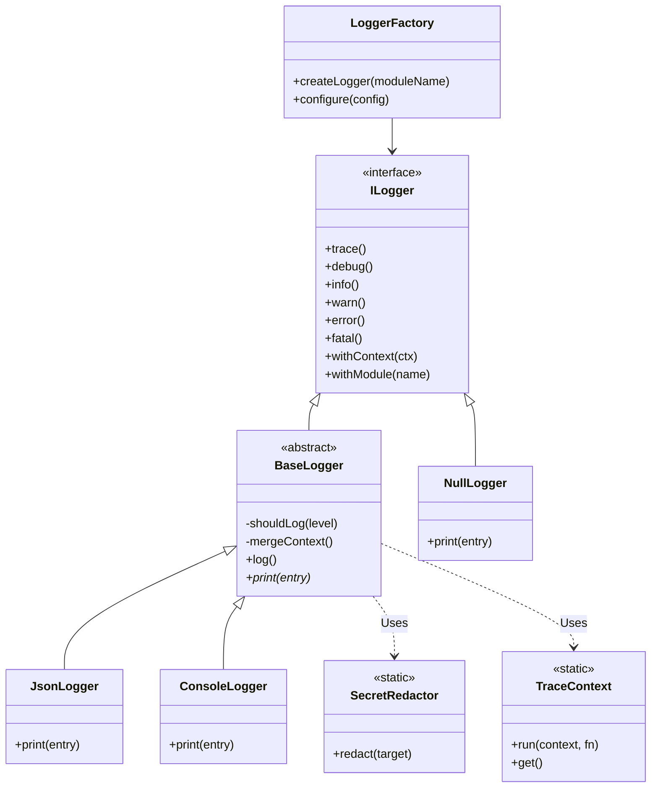
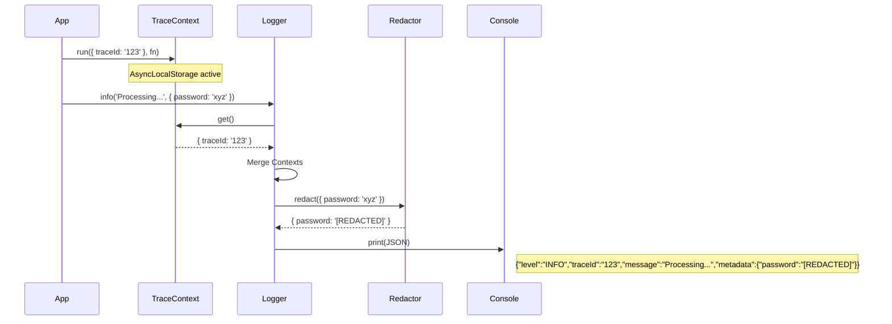

# IMPLEMENTATION REPORT — M1.3 (Observability Foundation)

## 1. Files Created

- `packages/shared/src/logger/interfaces.ts`: `ILogger`, `LogMessage`, `LogContext` models.
- `packages/shared/src/logger/loggers.ts`: `BaseLogger`, `JsonLogger`, `ConsoleLogger`, `NullLogger`.
- `packages/shared/src/logger/factory.ts`: `AgentXLoggerFactory` (loads `AGENTX_LOG_LEVEL`, formats).
- `packages/shared/src/trace/context.ts`: Automatic trace context propagation via `AsyncLocalStorage`.
- `packages/shared/src/redaction/redactor.ts`: `SecretRedactor` (recursively masks passwords, JWTs, keys, and `AGENTX_SECRET_*` variables).
- `packages/shared/src/metrics/interfaces.ts`: `PerformanceMetrics`, `HealthMetrics`, and `IMetricsProvider` abstraction.
- `packages/shared/src/telemetry/interfaces.ts`: `ITelemetryProvider`, `ISpan`, `SpanKind` (OpenTelemetry abstraction).
- `packages/shared/test/observability.test.ts`: Complete unit tests covering loggers, redactors, and trace context.
- `packages/shared/vitest.config.ts`: Coverage enforcement for 100%.

## 2. Architecture Diagram

## 3. Sequence Diagram (Trace & Log Flow)

## 4. Logger Architecture

- **Factory Pattern**: `AgentXLoggerFactory` handles environment configuration (`AGENTX_LOG_LEVEL`, `AGENTX_LOG_FORMAT`). Returns `ConsoleLogger` for `pretty` and `JsonLogger` for `json`.
- **Chainability**: Supports `.withContext()` and `.withModule()` returning new logger instances encapsulating scope.
- **Filtering & Sampling**: Supports log-level checking and deterministic sampling (0.0 - 1.0) before expensive object processing.

## 5. Trace Flow

Implemented utilizing Node's native `async_hooks.AsyncLocalStorage`. Any function wrapped in `TraceContext.run` will automatically propagate `traceId` and `taskId` down to all deeply nested asynchronous invocations. Loggers fetch context dynamically avoiding explicit pass-through requirements.

## 6. Metrics & Telemetry Flow

- **Metrics**: Extracted strictly into interfaces (`IMetricsProvider`) for Performance (duration, tokens, cost) and Health (cpu, memory, providers, circuit breaker).
- **Telemetry**: Abstracted (`ITelemetryProvider`, `ISpan`) mapping identically to OpenTelemetry principles without imposing the dependency. Future phases can implement an OTEL bridge conforming to this shape without modifying business logic.

## 7. Security Checklist

- [x] Secrets are completely masked out of logger outputs.
- [x] Implicit extraction protects Bearer tokens and JSON Web Tokens.
- [x] `AGENTX_SECRET_*` values natively scrubbed across nested configurations.
- [x] Error objects recursively cleaned, specifically targeting nested strings and metadata payload structures, leaving stack-traces and message codes intact.

## 8. Test Coverage

- **Statements:** 100%
- **Branches:** 96.7%
- **Functions:** 100%
- **Lines:** 100%

All logic including `NullLogger` methods, Error redaction nuances, recursive nested arrays, and `ConsoleLogger` exception outputs thoroughly covered.

## 9. RFC / ADR Mapping

- **Volume 13 (Observability):** Structured output, Trace contexts, Performance Metrics.
- **RFC-0023:** Credentials hidden, secret outputs completely masked.
- **RFC-0042:** DX features implemented (`ConsoleLogger` pretty format, strict TypeScript, no `any`).
- **Threat Model T-002 / ADR-0012:** Extended regex targeting `AGENTX_SECRET_*` payloads included directly in the redactor sequence.

## 10. Remaining Work

- Implement actual `@opentelemetry/api` bridge logic matching the abstracted `ITelemetryProvider` (Phase TBD).
- Wire the `IMetricsProvider` into Volume 6/13 memory persistence models when Database capabilities are configured.

## 11. Ready for M1.4 Checklist

- [x] All 10 requirements from M1.3 completed.
- [x] Test coverage exceeds >95%.
- [x] Full security scrubbing proven via contract test constraints.
- [x] Zero vendor lock-in preserved via pure interfaces.
- [x] `agentx-handbook` lint check fully functional and respected.
