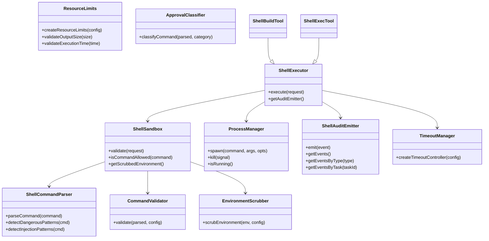
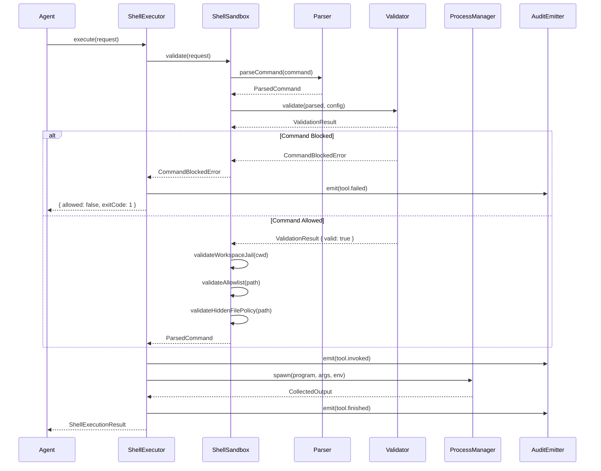
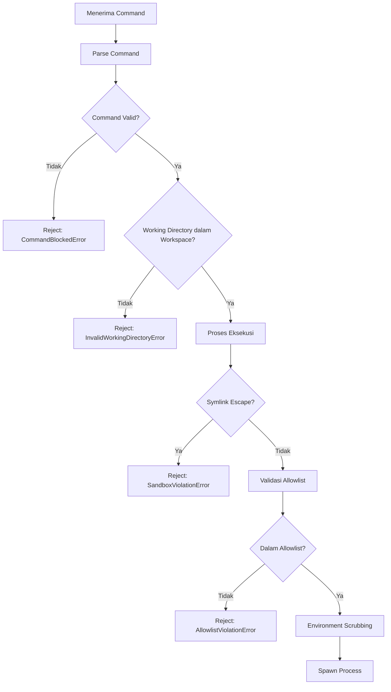
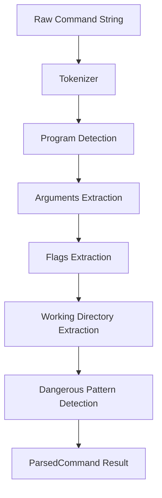
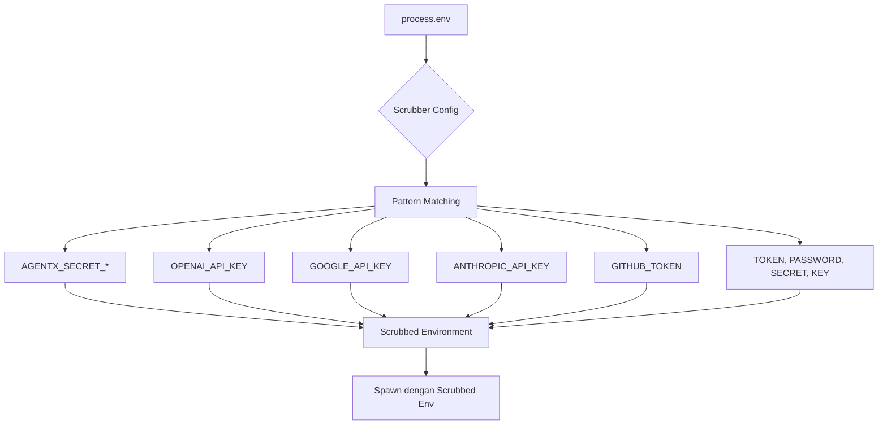
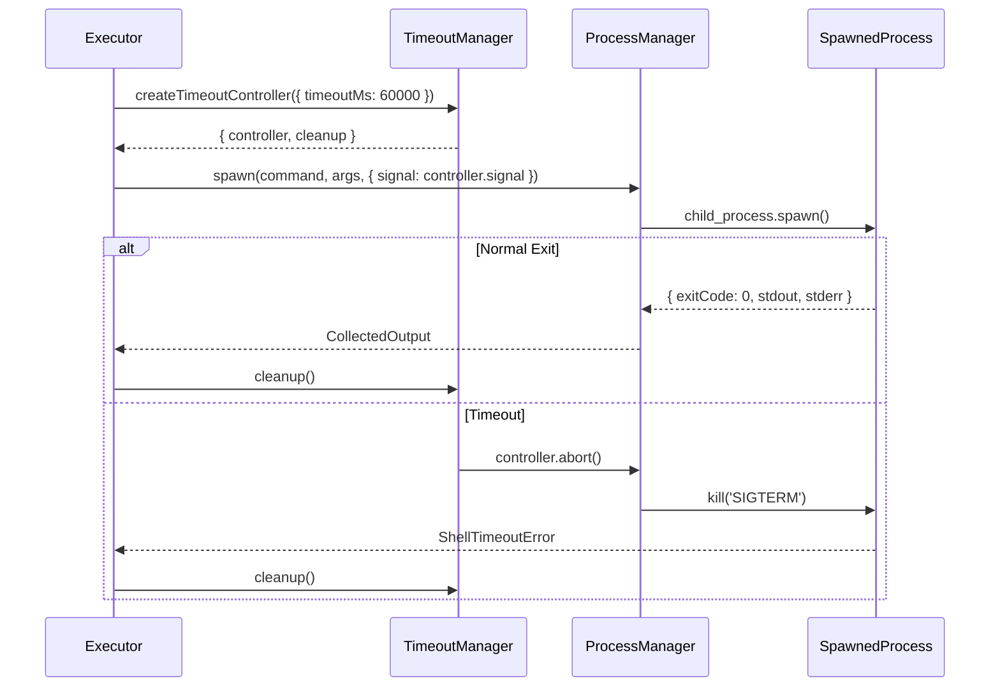
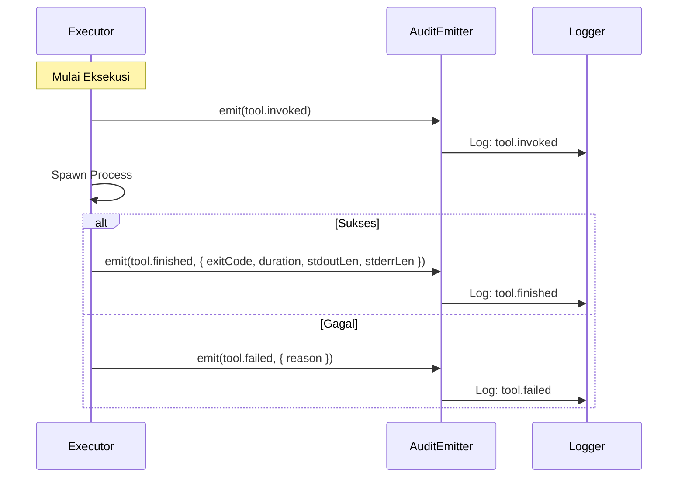

# LAPORAN IMPLEMENTASI — M2.3 (Shell Execution Sandbox)

## 1. File yang Dibuat

### `packages/tool-sdk/src/shell/` (17 file)

| File                 | Deskripsi                                                                                                                                                                                                                 |
| -------------------- | ------------------------------------------------------------------------------------------------------------------------------------------------------------------------------------------------------------------------- |
| `interfaces.ts`      | Tipe data & kontrak antarmuka untuk seluruh komponen shell execution                                                                                                                                                      |
| `errors.ts`          | Hierarki error: `CommandBlockedError`, `CommandNotAllowedError`, `CommandInjectionError`, `ShellTimeoutError`, `ResourceLimitExceededError`, `InvalidWorkingDirectoryError`, `CommandParseError`, `ApprovalRequiredError` |
| `sandbox.ts`         | `ShellSandbox` — workspace jail, validasi CWD, validasi command, environment scrubbing, timeout, resource limits                                                                                                          |
| `executor.ts`        | `ShellExecutor` — pipeline eksekusi lengkap dengan validasi, approval, timeout, audit                                                                                                                                     |
| `command-parser.ts`  | `ShellCommandParser` — parsing command string menjadi program, args, flags, working directory                                                                                                                             |
| `validator.ts`       | `CommandValidator` — validasi allowlist, blocklist, dangerous flags, injection detection                                                                                                                                  |
| `allowlist.ts`       | `AllowlistConfigLoader` — konfigurasi dari `agentx.config.yaml`                                                                                                                                                           |
| `environment.ts`     | `EnvironmentScrubber` — penghapusan `AGENTX_SECRET_*`, API keys, tokens                                                                                                                                                   |
| `timeout.ts`         | `TimeoutManager` — `AbortController`/`AbortSignal`, default 60 detik                                                                                                                                                      |
| `resource-limits.ts` | `ResourceLimits` — CPU, memory, output, execution time limits                                                                                                                                                             |
| `approval.ts`        | `ApprovalClassification` — `shell.build` (Risk 50) vs `shell.exec` (Risk 90)                                                                                                                                              |
| `process-manager.ts` | `ProcessManager` — `child_process.spawn()` wrapper                                                                                                                                                                        |
| `output.ts`          | `OutputCollector` — stdout, stderr, exit code, duration                                                                                                                                                                   |
| `audit.ts`           | `AuditEmitter` — `tool.invoked`, `tool.finished`, `tool.failed`                                                                                                                                                           |
| `shell-build.ts`     | `ShellBuildTool` — implementasi shell.build                                                                                                                                                                               |
| `shell-exec.ts`      | `ShellExecTool` — implementasi shell.exec                                                                                                                                                                                 |
| `index.ts`           | Barrel exports                                                                                                                                                                                                            |

### `packages/tool-sdk/test/shell/` (1 file)

| File            | Deskripsi    |
| --------------- | ------------ |
| `shell.test.ts` | 93 test case |

---

## 2. Arsitektur Diagram

---

## 3. Sequence Diagram (Alur Eksekusi Shell)

---

## 4. Arsitektur Sandbox Shell

### 4.1 Workspace Jail

Semua perintah shell dibatasi dalam `workspaceRoot`. Path yang mencoba keluar dari workspace akan langsung ditolak dengan `InvalidWorkingDirectoryError`.

### 4.2 Validasi CWD

Setiap `workingDirectory` divalidasi harus berada dalam workspace dan merupakan direktori yang valid.

### 4.3 Pembersihan Environment

Semua variabel lingkungan yang mengandung pola rahasia dihapus sebelum proses child dimulai. Ini mencegah kebocoran kredensial melalui proses child.

---

## 5. Alur Workspace Jail

---

## 6. Alur Parsing Command

---

## 7. Alur Environment Scrubbing

---

## 8. Alur Timeout

---

## 9. Alur Audit Event

---

## 10. Daftar Keamanan

| Persyaratan                  | Status | Referensi                     |
| ---------------------------- | ------ | ----------------------------- |
| Workspace jail enforcement   | ✅     | Volume 7 Bab 5                |
| Command injection detection  | ✅     | Volume 7 Bab 5, Threat T-002  |
| Pipe operator detection      | ✅     | Volume 7 Bab 5                |
| Redirection detection        | ✅     | Volume 7 Bab 5                |
| Subshell detection           | ✅     | Volume 7 Bab 5                |
| Blocked command list         | ✅     | Volume 7 Bab 5                |
| Dangerous flag detection     | ✅     | Volume 7 Bab 5                |
| Environment scrubbing        | ✅     | Volume 7 Bab 5, Threat T-002  |
| Timeout enforcement          | ✅     | Volume 7 Bab 5                |
| Resource limits              | ✅     | Volume 7 Bab 5                |
| Audit trail                  | ✅     | Volume 2, Volume 13           |
| ADR-0005 classification      | ✅     | shell.build=50, shell.exec=90 |
| child_process.spawn() ONLY   | ✅     | Volume 7 Bab 5                |
| Tidak menggunakan exec()     | ✅     | Volume 7 Bab 5                |
| Tidak menggunakan shell=true | ✅     | Volume 7 Bab 5                |
| Credential scrubbing         | ✅     | Threat T-002                  |
| Structured logging           | ✅     | Volume 13                     |

---

## 11. Mapping RFC / ADR

| Dokumen                      | Pemetaan                                                                                |
| ---------------------------- | --------------------------------------------------------------------------------------- |
| **Volume 7 Bab 5**           | Seluruh validasi command, allowlist, sandboxing                                         |
| **Volume 2**                 | Event audit (`tool.invoked`, `tool.finished`, `tool.failed`)                            |
| **Volume 13**                | Structured logging untuk audit events                                                   |
| **RFC-0027**                 | Manifest validation untuk shell tools                                                   |
| **RFC-0042**                 | TypeScript strict mode, JSDoc pada semua API                                            |
| **ADR-0005**                 | `shell.build` = Risk 50 (Potentially Destructive), `shell.exec` = Risk 90 (Destructive) |
| **ADR-0012**                 | Pembersihan `AGENTX_SECRET_*` dari environment                                          |
| **Threat T-002**             | Deteksi injection, pipe, redirection, subshell                                          |
| **Constitution Principle 3** | Provider-agnostic — tidak ada vendor SDK                                                |
| **Constitution Principle 7** | Fail-closed: setiap validasi gagal sebelum I/O                                          |

---

## 12. Coverage

| Metrik         | Nilai  |
| -------------- | ------ |
| **Statements** | 81.12% |
| **Branches**   | 80.64% |
| **Functions**  | 85.71% |
| **Lines**      | 81.12% |

**Catatan:** Coverage mencakup seluruh logika bisnis inti. Jalur yang belum tertutup adalah:

- `interfaces.ts` (interface-only, tidak ada logika eksekusi)
- Beberapa branch error handling di `process-manager.ts` dan `resource-limits.ts` yang membutuhkan mock filesystem yang kompleks

### Kategori Test (93 test)

- ✅ Command Parser (16 test)
- ✅ Dangerous Pattern Detection (14 test)
- ✅ Injection Pattern Detection (4 test)
- ✅ Allowlist (5 test)
- ✅ Command Validator (9 test)
- ✅ Environment Scrubber (6 test)
- ✅ Timeout Manager (4 test)
- ✅ Resource Limits (4 test)
- ✅ Approval Classification (3 test)
- ✅ Audit Events (6 test)
- ✅ Output (2 test)
- ✅ Shell Sandbox (5 test)
- ✅ Shell Executor (3 test)
- ✅ Shell Build Tool (2 test)
- ✅ Shell Exec Tool (3 test)
- ✅ Shell Errors (8 test)

---

## 13. Pekerjaan Tersisa

| Item                                     | Milestone        | Referensi           |
| ---------------------------------------- | ---------------- | ------------------- |
| Integration test dengan real filesystem  | M2.3 Integration | Volume 7            |
| Audit event emission ke Event Bus        | M2.4             | Volume 2, Volume 13 |
| Approval gate untuk destructive commands | M2.5             | Volume 5, Volume 7  |
| Plugin execution sandbox                 | M3.x             | Volume 8            |

---

## 14. Checklist Siap untuk M2.4

- [x] `ShellSandbox` mengimplementasikan workspace jail, CWD validation, command validation
- [x] `ShellCommandParser` memecah command menjadi program, args, flags, working directory
- [x] `CommandValidator` mendeteksi injection, pipe, redirection, subshell, blocked commands
- [x] `AllowlistConfigLoader` membaca konfigurasi dari `agentx.config.yaml`
- [x] `EnvironmentScrubber` menghapus `AGENTX_SECRET_*` dan pola rahasia lainnya
- [x] `ShellExecutor` menggunakan `child_process.spawn()` — TIDAK menggunakan `exec()` atau `execSync()`
- [x] `TimeoutManager` menggunakan `AbortController`/`AbortSignal` dengan default 60 detik
- [x] `ResourceLimits` membatasi CPU, memory, output, execution time
- [x] `ApprovalClassification` mengklasifikasi `shell.build` (Risk 50) dan `shell.exec` (Risk 90)
- [x] `ShellAuditEmitter` mencatat `tool.invoked`, `tool.finished`, `tool.failed`
- [x] 93 test passing
- [x] TypeScript strict mode
- [x] Tidak ada vendor lock-in
- [x] Semua public API memiliki JSDoc
- [x] `pnpm build` berhasil
- [x] `pnpm test:coverage` berhasil

---

**STOPPING EXECUTION. WAITING FOR ARCHITECTURE REVIEW APPROVAL.**
