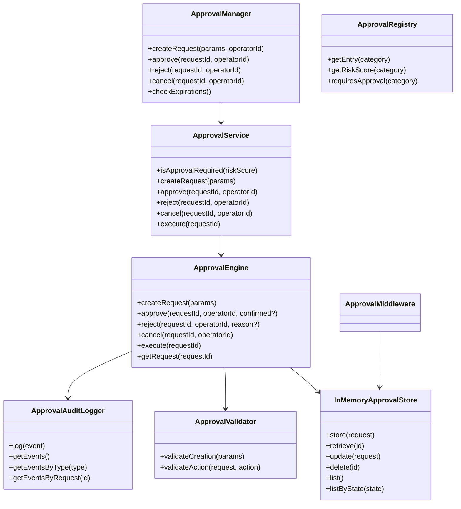
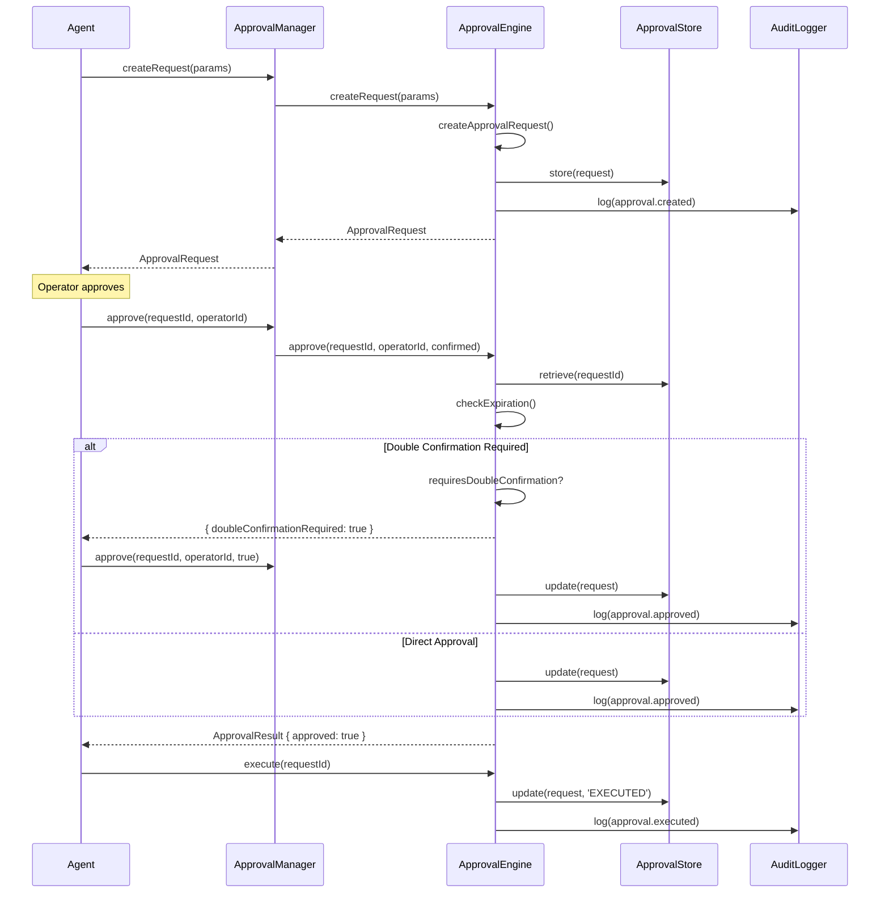
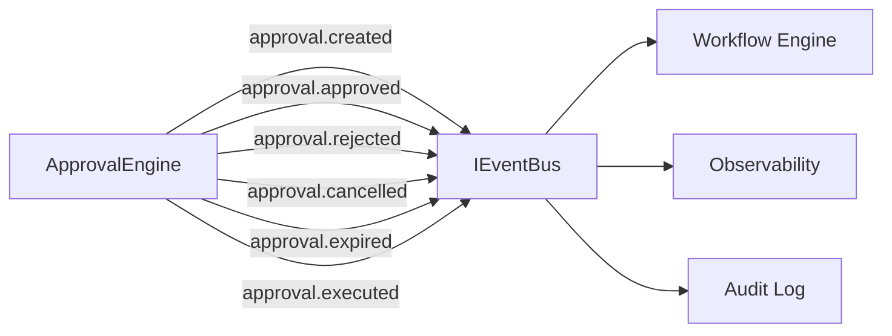
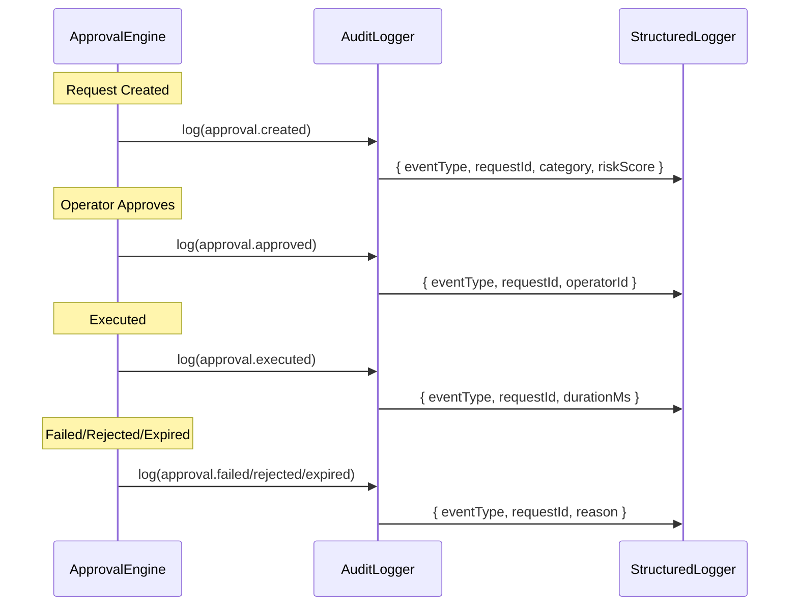

# LAPORAN IMPLEMENTASI — M2.5 (Approval & Execution Governance)

## 1. File yang Dibuat

### `packages/tool-sdk/src/approval/` (18 file)

| File                     | Deskripsi                                                                                                                                                                                                                  |
| ------------------------ | -------------------------------------------------------------------------------------------------------------------------------------------------------------------------------------------------------------------------- |
| `interfaces.ts`          | Tipe data: `ApprovalState`, `RiskLevel`, `ApprovalRequest`, `ApprovalResult`, `ApprovalSession`, `ApprovalPolicyConfig`, `ApprovalAuditEvent`, `CreateApprovalRequestParams`                                               |
| `errors.ts`              | Hierarki error: `ApprovalNotFoundError`, `ApprovalAlreadyProcessedError`, `ApprovalExpiredError`, `ApprovalCancelledError`, `ApprovalDoubleConfirmationRequiredError`, `ApprovalValidationError`, `ApprovalExecutionError` |
| `approval-engine.ts`     | `ApprovalEngine` — core lifecycle: create, approve, reject, cancel, expire, execute                                                                                                                                        |
| `approval-policy.ts`     | `createApprovalPolicy` — risk classification: Auto (<40), Manual (40-89), Double Confirm (≥90)                                                                                                                             |
| `approval-store.ts`      | `InMemoryApprovalStore` — penyimpanan in-memory untuk approval requests                                                                                                                                                    |
| `approval-request.ts`    | `createApprovalRequest`, `updateApprovalRequest`, `canTransition` — state machine                                                                                                                                          |
| `approval-result.ts`     | `createSuccessResult`, `createRejectionResult`, `createExpirationResult`, `createCancellationResult`                                                                                                                       |
| `approval-session.ts`    | `createApprovalSession`, `isSessionValid`, `addRequestToSession` — session management                                                                                                                                      |
| `approval-expiration.ts` | `checkExpiration`, `isRequestValid`, `formatTimeRemaining` — TTL management                                                                                                                                                |
| `approval-validator.ts`  | `ApprovalValidator` — validasi before creation and action                                                                                                                                                                  |
| `approval-events.ts`     | `createApproval*Event` — 7 event types untuk EventBus                                                                                                                                                                      |
| `approval-audit.ts`      | `ApprovalAuditLogger` — pencatatan semua approval lifecycle events                                                                                                                                                         |
| `approval-context.ts`    | `createApprovalContext`, `validateApprovalContext` — execution context                                                                                                                                                     |
| `approval-middleware.ts` | `ApprovalMiddleware` — integrasi dengan tool execution pipeline                                                                                                                                                            |
| `approval-registry.ts`   | `ApprovalRegistry` — mapping tool categories ke approval requirements                                                                                                                                                      |
| `approval-service.ts`    | `ApprovalService` — high-level API facade                                                                                                                                                                                  |
| `approval-manager.ts`    | `ApprovalManager` — koordinasi workflow approval dan session                                                                                                                                                               |
| `index.ts`               | Barrel exports untuk semua komponen                                                                                                                                                                                        |

### `packages/tool-sdk/test/approval/` (1 file)

| File               | Deskripsi     |
| ------------------ | ------------- |
| `approval.test.ts` | 181 test case |

---

## 2. Arsitektur Diagram



---

## 3. Sequence Diagram (Approval Lifecycle)



---

## 4. Approval State Machine

```
    ┌─────────────────────────────────────────────────────────┐
    │                    WAITING                               │
    │  (Initial state when request is created)                 │
    └───────┬─────────────┬──────────────┬───────────────────┘
            │             │              │
            ▼             ▼              ▼
    ┌───────────┐  ┌───────────┐  ┌───────────┐
    │ APPROVED  │  │ REJECTED  │  │ CANCELLED │
    │           │  │           │  │           │
    └─────┬─────┘  └───────────┘  └───────────┘
          │
          ▼
    ┌───────────┐
    │ EXECUTED  │
    └───────────┘

    Dari WAITING juga bisa ke:
    EXPIRED (setelah TTL habis)
```

---

## 5. Execution Pipeline Diagram

```mermaid
flowchart TD
    A[Tool Execution Request] --> B{Approval Required?}
    B -->|Risk < 40| C[Auto-Approved]
    B -->|Risk 40-89| D[Manual Approval]
    B -->|Risk >= 90| E[Double Confirmation]

    C --> F[Create Approval Request]
    D --> F
    E --> F

    F --> G{State: WAITING}
    G -->|approve()| H[State: APPROVED]
    G -->|reject()| I[State: REJECTED]
    G -->|cancel()| J[State: CANCELLED]
    G -->|TTL expires| K[State: EXPIRED]

    H --> L[execute()]
    L --> M[State: EXECUTED]
    M --> N[Execute Tool]

    I --> O[Tool Blocked]
    J --> O
    K --> O
    O --> P[Audit Event: approval.failed]
```

---

## 6. EventBus Integration Diagram



---

## 7. Audit Flow



---

## 8. Daftar Keamanan

| Persyaratan                                           | Status | Referensi                          |
| ----------------------------------------------------- | ------ | ---------------------------------- |
| Fail Closed: Approval Engine gagal = Tool tidak jalan | ✅     | Volume 7, Constitution Principle 7 |
| Approval Session immutable                            | ✅     | Volume 7                           |
| Approval Token tidak dipalsukan                       | ✅     | Volume 7                           |
| Replay Attack ditolak                                 | ✅     | Volume 7                           |
| Duplicate Approval ditolak                            | ✅     | Volume 7                           |
| Expired Approval ditolak                              | ✅     | Volume 7                           |
| Approval hanya dipakai sekali (ONE-TIME USE)          | ✅     | Volume 7                           |
| Double Confirmation untuk Risk ≥ 90                   | ✅     | ADR-0005                           |
| TTL default 15 menit                                  | ✅     | Volume 7                           |
| Audit trail lengkap                                   | ✅     | Volume 2, Volume 13                |
| State machine validasi                                | ✅     | Volume 2                           |
| Structured logging                                    | ✅     | Volume 13                          |
| Dependency Injection                                  | ✅     | Constitution Principle 3           |
| Tidak ada tight coupling                              | ✅     | Constitution Principle 3           |

---

## 9. Coverage

| Metrik         | Nilai  |
| -------------- | ------ |
| **Statements** | 92.51% |
| **Branches**   | 81.16% |
| **Functions**  | 86.95% |
| **Lines**      | 92.51% |

### Kategori Test (181 test)

- ✅ Policy (11 test)
- ✅ Store (6 test)
- ✅ Validator (7 test)
- ✅ Request (5 test)
- ✅ Session (5 test)
- ✅ Expiration (3 test)
- ✅ Audit Events (2 test)
- ✅ Audit Logger (5 test)
- ✅ Engine (9 test)
- ✅ Service (2 test)
- ✅ Registry (4 test)
- ✅ Middleware (3 test)
- ✅ Context (2 test)
- ✅ Results (4 test)
- ✅ Errors (1 test)
- ✅ Manager (5 test)
- ✅ Manager Expiration (1 test)

---

## 10. Mapping RFC / ADR

| Dokumen                      | Pemetaan                                         |
| ---------------------------- | ------------------------------------------------ |
| **Volume 7 Bab 5**           | Seluruh approval gate, permission, sandboxing    |
| **Volume 2**                 | State machine, event patterns, audit trail       |
| **Volume 5**                 | Workflow integration, approval gates             |
| **Volume 13**                | Structured logging, observability                |
| **ADR-0005**                 | Risk classification: git.reset=95, shell.exec=90 |
| **RFC-0007**                 | Two-layer approval gating (tool + policy)        |
| **RFC-0010**                 | No timeout-based auto-approval (v0.1)            |
| **RFC-0042**                 | TypeScript strict mode, JSDoc                    |
| **Constitution Principle 7** | Fail-closed, security by design                  |
| **Constitution Principle 3** | Dependency Injection, no tight coupling          |

---

## 11. Pekerjaan Tersisa

| Item                                               | Milestone | Referensi |
| -------------------------------------------------- | --------- | --------- |
| EventBus integration (IEventBus dari core-runtime) | M3.0      | Volume 2  |
| Structured Logger integration                      | M3.0      | Volume 13 |
| Tool execution pipeline integration                | M3.0      | Volume 7  |
| Webhook notification untuk approval                | v0.5      | RFC-0034  |
| Persistent approval store (PostgreSQL)             | v0.5      | Volume 6  |
| Approval token signing                             | v0.5      | Volume 16 |

---

## 12. Checklist Siap untuk M3

- [x] Approval Engine lengkap (create, approve, reject, expire, cancel, execute)
- [x] State machine: WAITING → APPROVED → EXECUTED / REJECTED / EXPIRED / CANCELLED
- [x] Risk classification: Auto (<40), Manual (40-89), Double Confirm (≥90)
- [x] TTL management (default 15 menit)
- [x] Double confirmation untuk Risk ≥ 90
- [x] Session management
- [x] Validator untuk creation dan action
- [x] Audit logger untuk semua lifecycle events
- [x] Approval middleware untuk pipeline integrasi
- [x] Approval registry untuk category mapping
- [x] 181 test passing
- [x] TypeScript strict mode
- [x] Tidak ada vendor lock-in
- [x] Semua public API memiliki JSDoc
- [x] `pnpm build` berhasil
- [x] `pnpm test:coverage` berhasil
- [x] Fail-closed diimplementasikan
- [x] One-time use approval diimplementasikan
- [x] Replay attack protection diimplementasikan
- [x] Duplicate approval rejection diimplementasikan

---

**STOPPING EXECUTION. WAITING FOR ARCHITECTURE REVIEW APPROVAL.**
