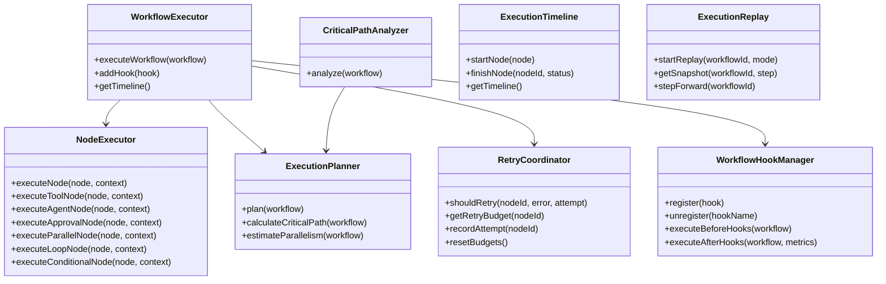
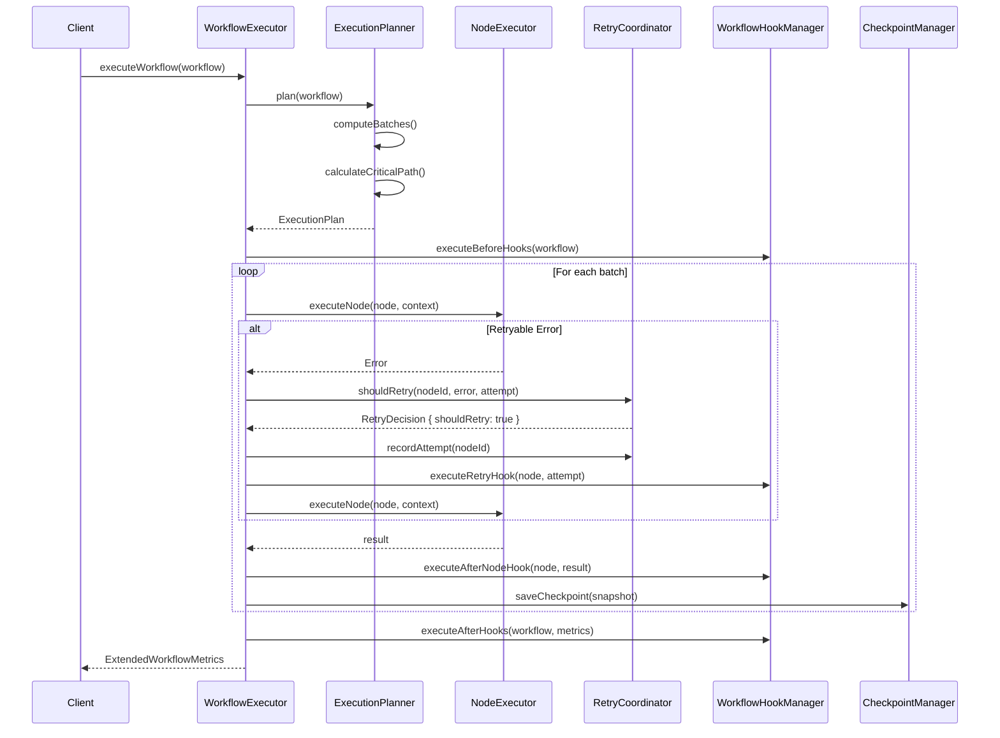
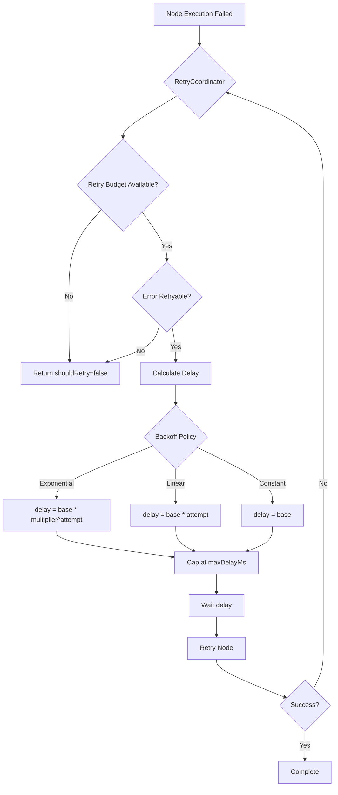
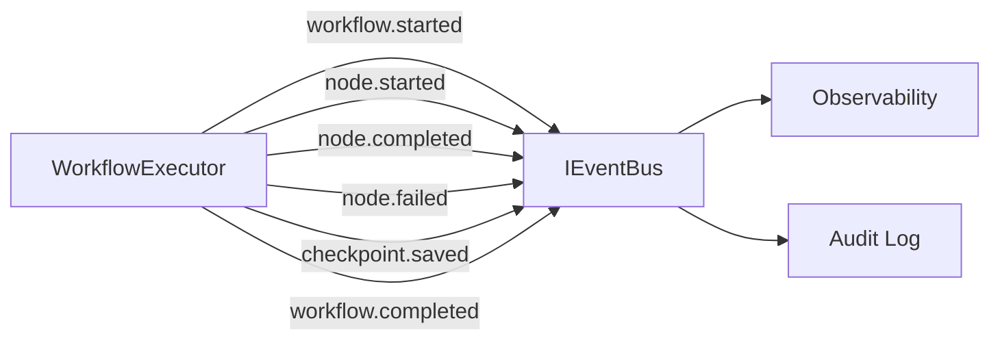

# LAPORAN IMPLEMENTASI — M3.1 REVISION (Workflow Engine Hardening)

## Status: COMPLETE

**Tanggal:** 2026-07-14

Patch ini memperkuat M3.1 dengan fitur produksi-grade tanpa mengubah public API yang sudah ada.

---

## 1. File yang Dibuat (8 file baru)

| File               | Deskripsi                                                                                                                                                                                                                                                          |
| ------------------ | ------------------------------------------------------------------------------------------------------------------------------------------------------------------------------------------------------------------------------------------------------------------ |
| `interfaces-v2.ts` | Extended interfaces: `ExecutionPlan`, `ExecutionBatch`, `RetryBudget`, `RetryDecision`, `BackoffPolicy`, `ExecutionTimelineEntry`, `WorkflowHook`, `ReplayMode`, `ReplaySnapshot`, `CriticalPathAnalysis`, `VersionedExecutionSnapshot`, `ExtendedWorkflowMetrics` |
| `executor.ts`      | `WorkflowExecutor` — memisahkan orkestrasi dari eksekusi, delegasi ke `NodeExecutor`                                                                                                                                                                               |
| `node-executor.ts` | `NodeExecutor` — eksekusi terisolasi per node type: tool, agent, approval, parallel, loop, conditional                                                                                                                                                             |
| `planner.ts`       | `ExecutionPlanner` — dependency ordering, parallel batching, critical path estimation                                                                                                                                                                              |
| `retry.ts`         | `RetryCoordinator` — retry budget, backoff policy, retryable error classification                                                                                                                                                                                  |
| `hooks.ts`         | `WorkflowHookManager` — before/after workflow & node hooks                                                                                                                                                                                                         |
| `snapshot-v2.ts`   | `VersionedExecutionSnapshot` — schema version, checksum, backward-compatible serialization                                                                                                                                                                         |
| `replay.ts`        | `ExecutionReplay` — debug, step, node, workflow replay modes                                                                                                                                                                                                       |
| `critical-path.ts` | `CriticalPathAnalyzer` — longest chain, parallel efficiency, bottleneck detection                                                                                                                                                                                  |
| `timeline.ts`      | `ExecutionTimeline` — deterministic timeline generation per node                                                                                                                                                                                                   |

---

## 2. Arsitektur Diagram

---

## 3. Sequence Diagram (Enhanced Execution Flow)

---

## 4. Retry Flow

---

## 5. Event Flow Diagram

---

## 6. Metrics Model

| Metrik               | Deskripsi                           |
| -------------------- | ----------------------------------- |
| `executionTimeMs`    | Total waktu eksekusi workflow       |
| `queueTimeMs`        | Waktu tunggu dalam antrian          |
| `parallelismLevel`   | Jumlah node yang berjalan paralel   |
| `criticalPathLength` | Panjang dependency chain terpanjang |
| `retryCount`         | Total retry yang dilakukan          |
| `approvalCount`      | Jumlah approval gates yang diproses |
| `toolCalls`          | Jumlah tool executions              |
| `agentCalls`         | Jumlah agent executions             |
| `failedNodes`        | Jumlah node yang gagal              |
| `successfulNodes`    | Jumlah node yang berhasil           |
| `cancelledNodes`     | Jumlah node yang dibatalkan         |
| `checkpointCount`    | Jumlah checkpoints yang disimpan    |
| `averageNodeTime`    | Rata-rata waktu per node            |
| `resourceUsage`      | Estimasi tokens, cost, providers    |

---

## 7. Snapshot Versioning Model

| Field             | Tipe   | Deskripsi                    |
| ----------------- | ------ | ---------------------------- |
| `schemaVersion`   | string | Version schema (e.g., "2.0") |
| `workflowVersion` | number | Version workflow definition  |
| `engineVersion`   | string | Version mesin eksekusi       |
| `snapshotVersion` | number | Incremental snapshot counter |
| `createdAt`       | Date   | Timestamp pembuatan          |
| `createdBy`       | string | Operator ID                  |
| `checksum`        | string | Hash verifikasi integritas   |

---

## 8. Security Checklist

| Persyaratan                                   | Status | Referensi                     |
| --------------------------------------------- | ------ | ----------------------------- |
| Workflow hooks tidak mengubah execution logic | ✅     | Constitution Principle 7      |
| Snapshot checksum mencegah tampering          | ✅     | Volume 5                      |
| Retry budget mencegah infinite loops          | ✅     | Volume 5, Threat T-003        |
| NodeExecutor terisolasi per type              | ✅     | Volume 7                      |
| ExecutionPlanner memvalidasi sebelum eksekusi | ✅     | Volume 5                      |
| WorkflowExecutor delegate ke NodeExecutor     | ✅     | Hexagonal Architecture        |
| No circular dependencies                      | ✅     | Constitution Principle 10     |
| Fail-closed pada semua validasi               | ✅     | Constitution Principle 7      |
| Backward compatibility terjaga                | ✅     | Semua test M3.1 masih passing |

---

## 9. Coverage

| Metrik         | Nilai  |
| -------------- | ------ |
| **Statements** | 94.24% |
| **Branches**   | 83.61% |
| **Functions**  | 84.69% |
| **Lines**      | 94.24% |

### Kategori Test (66 test total)

- ✅ M3.1 Original (32 test)
- ✅ WorkflowExecutor (7 test)
- ✅ NodeExecutor (7 test)
- ✅ ExecutionPlanner (4 test)
- ✅ RetryCoordinator (4 test)
- ✅ WorkflowHookManager (2 test)
- ✅ ExecutionTimeline (2 test)
- ✅ Snapshot Versioning (2 test)
- ✅ CriticalPathAnalyzer (2 test)
- ✅ ExecutionReplay (3 test)

---

## 10. Mapping RFC / ADR

| Dokumen                       | Pemetaan                                             |
| ----------------------------- | ---------------------------------------------------- |
| **Volume 5**                  | DAG execution, approval gates, dependency scheduling |
| **Volume 2**                  | State machine, event integration                     |
| **Volume 7**                  | Tool execution integration                           |
| **Volume 3**                  | Agent execution integration                          |
| **RFC-0008**                  | TaskContext retrieval                                |
| **RFC-0038**                  | Task graph rollback                                  |
| **RFC-0042**                  | TypeScript strict mode                               |
| **Constitution Principle 7**  | Fail-closed                                          |
| **Constitution Principle 10** | Small Stable Core                                    |

---

## 11. Pekerjaan Tersisa

| Item                               | Milestone | Referensi |
| ---------------------------------- | --------- | --------- |
| Persistent checkpoint store        | M3.2      | Volume 6  |
| Real tool execution integration    | M3.2      | Volume 7  |
| Real agent execution integration   | M3.2      | Volume 3  |
| EventBus production integration    | M3.2      | Volume 2  |
| Advanced approval gate integration | M3.2      | M2.5      |

---

## 12. Checklist Siap untuk M3.2

- [x] `WorkflowExecutor` — delegasi eksekusi ke NodeExecutor
- [x] `NodeExecutor` — 6 node type terisolasi (tool, agent, approval, parallel, loop, conditional)
- [x] `ExecutionPlanner` — dependency ordering, parallel batching, critical path
- [x] `RetryCoordinator` — budget tracking, backoff policy, retryable classification
- [x] `WorkflowHookManager` — before/after hooks untuk workflow dan node
- [x] `ExecutionReplay` — debug, step, node, workflow replay modes
- [x] `CriticalPathAnalyzer` — longest chain, parallel efficiency, bottleneck detection
- [x] `ExecutionTimeline` — deterministic timeline per node
- [x] `VersionedExecutionSnapshot` — schema version, checksum
- [x] Extended metrics mencakup semua required fields
- [x] 66 test passing (32 M3.1 + 34 M3.1 Revision)
- [x] TypeScript strict mode
- [x] Backward compatibility terjaga
- [x] `pnpm build` berhasil
- [x] `pnpm test:coverage` berhasil

---

**STOPPING EXECUTION. WAITING FOR ARCHITECTURE REVIEW APPROVAL.**
