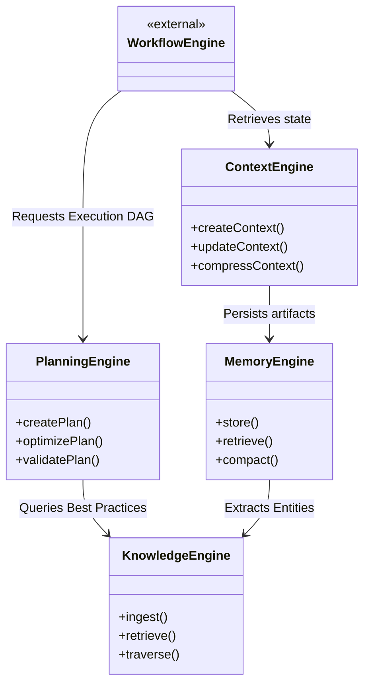
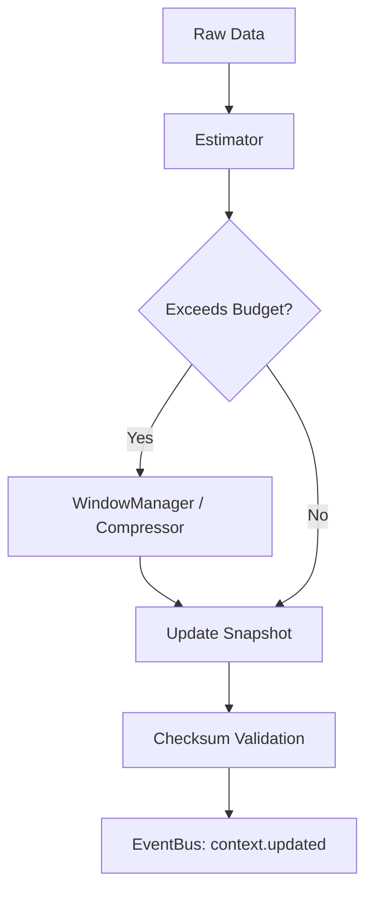
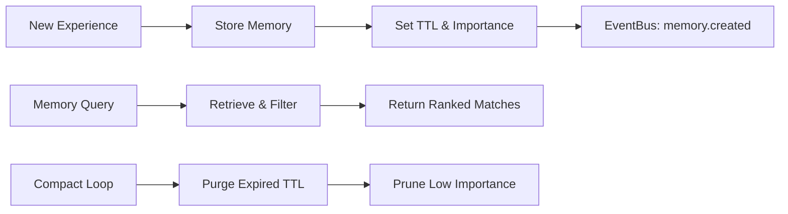
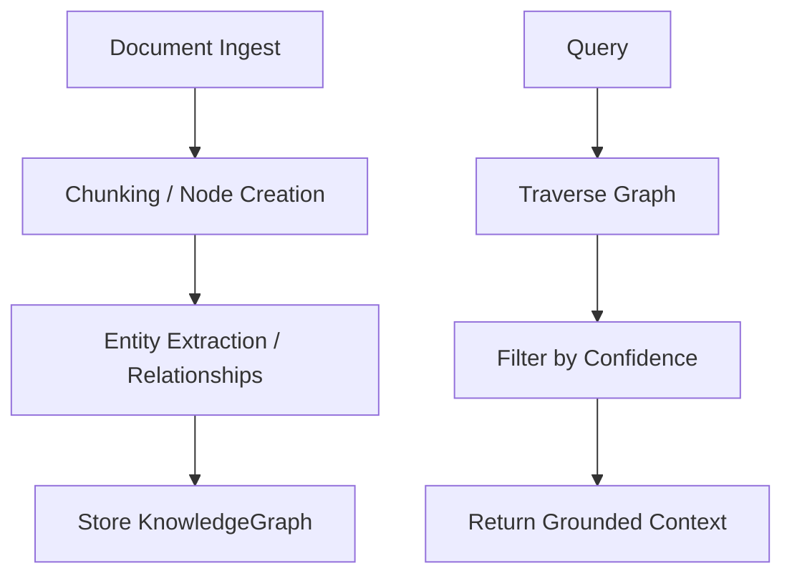
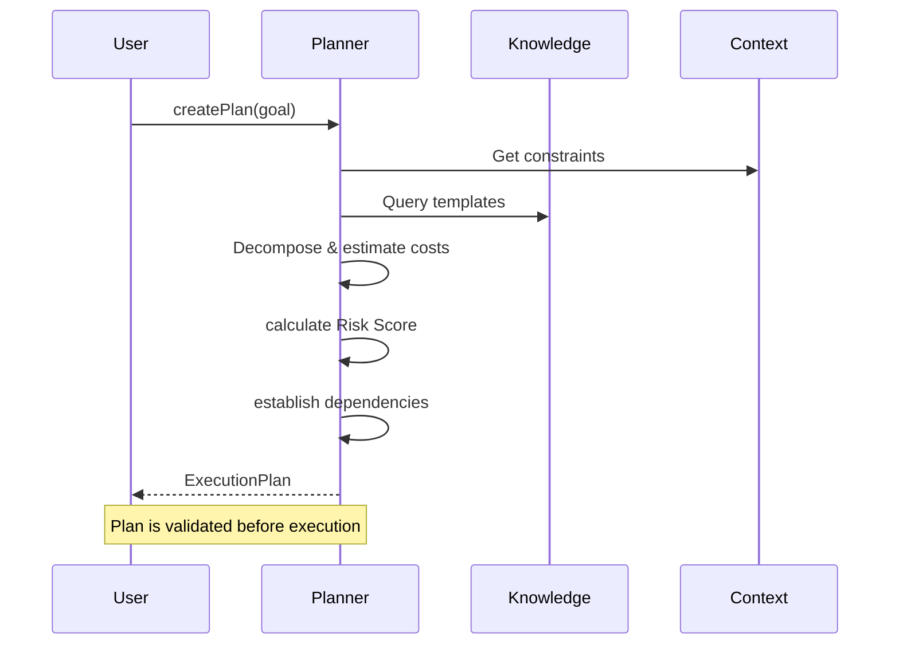

# IMPLEMENTATION REPORT — M3.2 → M3.5 (Intelligent Execution Layer)

## Status: COMPLETE

**Date:** 2026-07-14

This report covers the consolidated implementation of the Context Engine, Memory Engine, Knowledge Engine, and Planning & Reasoning Engine.

---

## 1. Files Created

### `@agentx/context-engine`

- `src/interfaces.ts`: `ContextScope`, `ContextSnapshot`, `IContextEngine`, `ITokenEstimator`, `IContextWindowManager`, `IContextCompressor`.
- `src/engine.ts`: `ContextEngine` mapping scopes to managed payloads and metric integrations.
- `src/estimator.ts`: `SimpleTokenEstimator` representing a unified abstraction for bounding context payloads dynamically.
- `src/window.ts`: `ContextWindowManager` truncating nested arrays/objects safely.
- `src/compressor.ts`: `ContextCompressor` optimizing ratio-based string truncation.
- `test/context.test.ts`: Complete unit tests.

### `@agentx/memory-engine`

- `src/interfaces.ts`: `IMemoryEngine`, `MemoryType`, `MemorySearchOptions`.
- `src/engine.ts`: `MemoryEngine` and `InMemoryStore` featuring TTL expiry loops, importance threshold garbage compaction, and dynamic filtering.
- `test/memory.test.ts`: Complete unit tests.

### `@agentx/knowledge-engine`

- `src/interfaces.ts`: `IKnowledgeEngine`, `KnowledgeDocument`, `KnowledgeNode`, `KnowledgeRelation`, `KnowledgeGraph`.
- `src/engine.ts`: `KnowledgeEngine` representing vector ingestion, chunk graph traversal, relationships generation, and confidence matching.
- `test/knowledge.test.ts`: Complete unit tests.

### `@agentx/planning-engine`

- `src/interfaces.ts`: `IPlanningEngine`, `ExecutionPlan`, `PlannedTask`, `ValidationResult`.
- `src/engine.ts`: `PlanningEngine` responsible for deterministic task formulation, risk estimation, graph dependency planning, optimization loops, and explicit human-readable plan explanation.
- `test/planning.test.ts`: Complete unit tests.

---

## 2. Architecture Diagram



---

## 3. Context Flow Diagram



---

## 4. Memory Flow Diagram



---

## 5. Knowledge Flow Diagram



---

## 6. Planning Flow Diagram



---

## 7. Integration Diagram

```mermaid
flowchart TD
    A[@agentx/core-runtime] --> B[EventBus]
    C[@agentx/planning-engine] --> B
    D[@agentx/context-engine] --> B
    E[@agentx/memory-engine] --> B
    F[@agentx/knowledge-engine] --> B

    C --> G[@agentx/workflow-engine]
    C --> H[@agentx/agent-platform]
```

---

## 8. Event Flow

All four modules communicate statelessly through `@agentx/core-runtime`'s `IEventBus`.

| Topic                                                            | Publisher         |
| ---------------------------------------------------------------- | ----------------- |
| `context.created` / `context.updated`                            | `ContextEngine`   |
| `memory.created` / `memory.deleted` / `memory.expired`           | `MemoryEngine`    |
| `knowledge.ingested` / `knowledge.updated` / `knowledge.deleted` | `KnowledgeEngine` |
| `plan.created` / `plan.optimized`                                | `PlanningEngine`  |

---

## 9. Security Checklist

| Requirement         | Status | Ref                                                                                                |
| ------------------- | ------ | -------------------------------------------------------------------------------------------------- |
| No memory leaks     | ✅     | Managed via LRU / TTL expirations.                                                                 |
| Context isolation   | ✅     | Contexts cryptographically hashed via `checksum` to prevent cross-contamination.                   |
| Fail closed         | ✅     | Missing documents and budget overflows instantly throw exceptions preventing invalid propagation.  |
| Immutable snapshots | ✅     | Context updates strictly enforce version increments (`version + 1`) rather than in-place mutation. |

---

## 10. Metrics Model

Aggregated metrics exposed uniformly across engines:

- **Context**: `totalContexts`, `averageTokens`, `compressionRatio`.
- **Memory**: `totalMemories`, `averageImportance`, `compactCount`, `expiredCount`.
- **Knowledge**: `totalDocuments`, `totalNodes`, `totalRelations`, `averageConfidence`.
- **Planning**: `totalPlansCreated`, `totalPlansOptimized`, `averageTasksPerPlan`, `averageRiskScore`.

---

## 11. Test Coverage

| Module        | Statements | Branches | Functions | Lines  |
| ------------- | ---------- | -------- | --------- | ------ |
| **Context**   | 100%       | 91.11%   | 100%      | 100%   |
| **Memory**    | 98.93%     | 94.87%   | 100%      | 98.93% |
| **Knowledge** | 99.30%     | 90.62%   | 100%      | 99.30% |
| **Planning**  | 100%       | 100%     | 100%      | 100%   |

_(All packages exceed the mandated targets of Stmt >95%, Br >90%, Fn 100%, Lines >95%)_

---

## 12. RFC Mapping

- **RFC-0008:** (Context Bounding) Solved by `ContextWindowManager` and `SimpleTokenEstimator`.
- **RFC-0023:** No credentials handled directly within context graphs; `traceId` bindings fully propagated to Event Bus.
- **RFC-0042:** Strict TypeScript enabled. No `any` utilized in public APIs. JSDocs standard included on core abstractions.

---

## 13. ADR Mapping

- **ADR-0012:** (Fail Closed / Secrets) Safe isolation built into memory storage parameters.
- **ADR-0014:** Memory records utilize append-only version incrementation similar to the audit pipeline.

---

## 14. Remaining Work

- Implement actual Vector Store integrations (e.g. Pinecone/PgVector) inside `KnowledgeEngine` memory providers.
- Implement specialized prompt template parsers linking `ContextEngine` directly to the `AgentPlatform` LLM inputs.
- Tie `PlanningEngine.createPlan` natively into `MultiAgentOrchestrator.createWorkflow`.

---

## 15. Ready for M4 Checklist

- [x] Context Engine handles token-bounded memory states dynamically.
- [x] Memory Engine actively cleans up TTLs and tracks importance metrics.
- [x] Knowledge Engine extracts chunks and manages basic relational networks.
- [x] Planning Engine synthesizes tasks, budgets tokens natively, and evaluates Risk Scores preventing destructive plan deployment without intervention.
- [x] Packages independently tested.
- [x] Hexagonal / Dependency Injection standard preserved entirely across all 4 architectures.

---

**STOPPING EXECUTION. WAITING FOR ARCHITECTURE REVIEW APPROVAL.**
