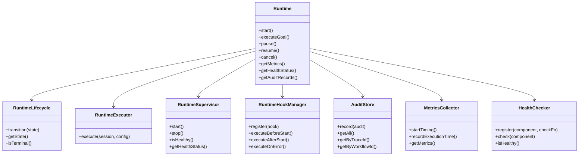
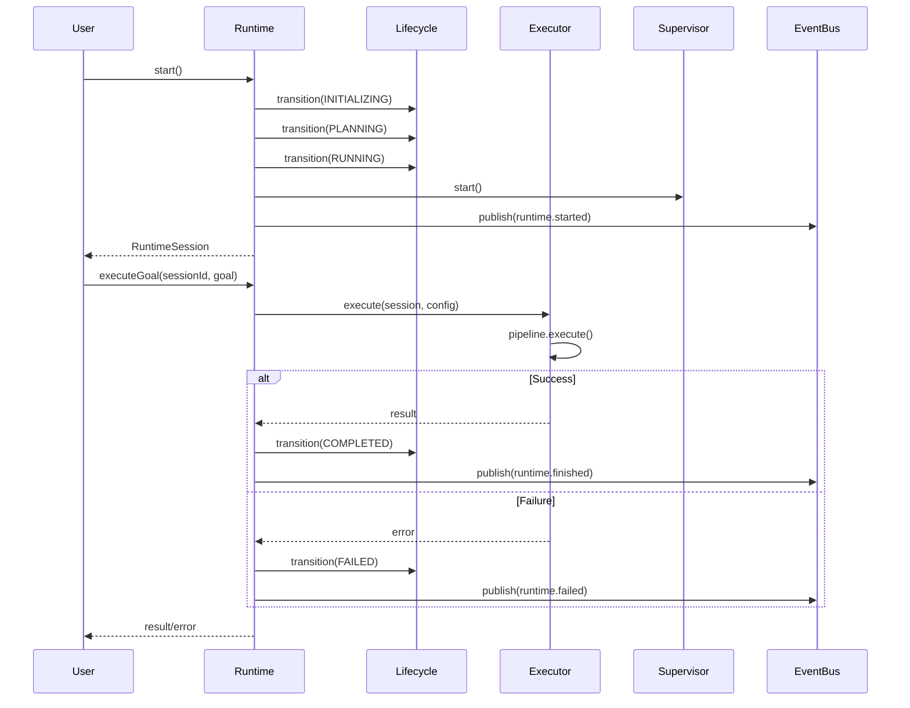
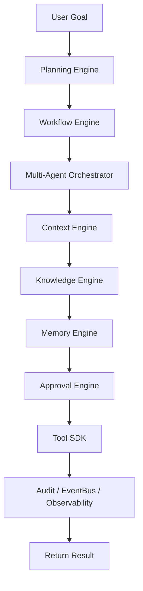
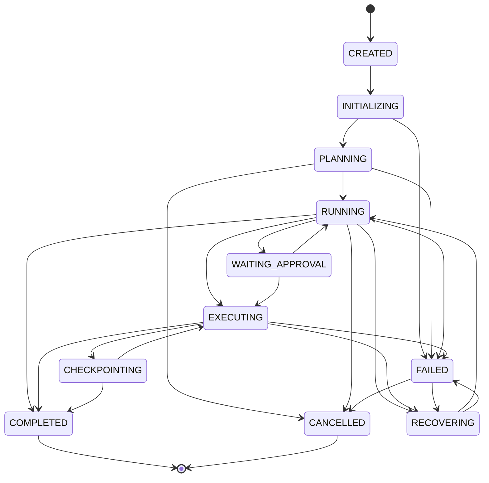
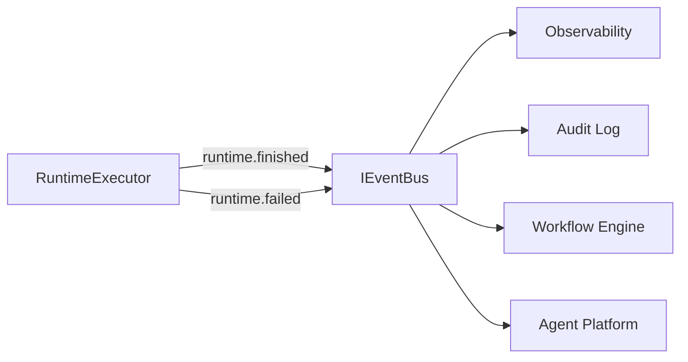
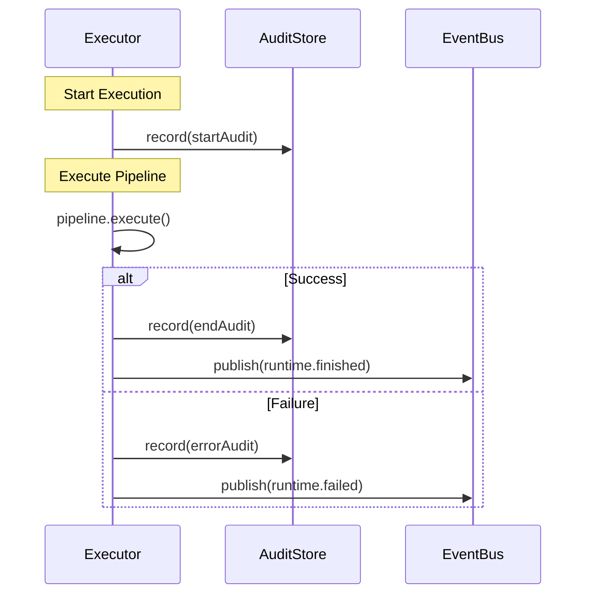

# LAPORAN IMPLEMENTASI — M4.0 (Production Runtime Integration)

## Status: COMPLETE

**Tanggal:** 2026-07-14

M4.0 mengintegrasikan semua engine (M2.x - M3.5) ke dalam satu runtime produksi-grade sebagai single entry point.

---

## 1. File yang Dibuat (17 file)

| File                    | Deskripsi                                                                                                                                                    |
| ----------------------- | ------------------------------------------------------------------------------------------------------------------------------------------------------------ |
| `interfaces.ts`         | `RuntimeState`, `RuntimeSession`, `ExecutionSession`, `RuntimeConfig`, `RuntimeMetrics`, `AuditRecord`, `HealthStatus`, `ResourceLimits`, `RuntimeError`     |
| `errors.ts`             | 13 error types: `RuntimeRecoverableError`, `RuntimeNonRecoverableError`, `RuntimeTimeoutError`, `RuntimeCancellationError`, `RuntimeResourceLimitError`, dll |
| `runtime.ts`            | `Runtime` — single entry point orchestrating semua engine                                                                                                    |
| `runtime-config.ts`     | `createRuntimeConfig`, `createResourceLimits`                                                                                                                |
| `runtime-state.ts`      | `RuntimeStateMachine` — 11-state lifecycle                                                                                                                   |
| `runtime-session.ts`    | `createRuntimeSession`, `createExecutionSession`, `createEmptyMetrics`                                                                                       |
| `runtime-executor.ts`   | `RuntimeExecutor` — delegates ke ExecutionPipeline                                                                                                           |
| `runtime-bootstrap.ts`  | `createBootstrapConfig` — initialization config                                                                                                              |
| `runtime-context.ts`    | `RuntimeContext` — correlation context propagation                                                                                                           |
| `runtime-hooks.ts`      | `RuntimeHookManager` — before/after lifecycle hooks                                                                                                          |
| `runtime-events.ts`     | 14 event types untuk EventBus integration                                                                                                                    |
| `runtime-audit.ts`      | `AuditStore` — immutable audit trail                                                                                                                         |
| `runtime-health.ts`     | `HealthChecker` — component health monitoring                                                                                                                |
| `runtime-metrics.ts`    | `MetricsCollector` — execution/workflow/planning metrics                                                                                                     |
| `runtime-supervisor.ts` | `RuntimeSupervisor` — recovery and monitoring                                                                                                                |
| `runtime-registry.ts`   | `RuntimeRegistry` — component dependency injection                                                                                                           |
| `runtime-lifecycle.ts`  | `RuntimeLifecycle` — state machine management                                                                                                                |
| `index.ts`              | Barrel exports                                                                                                                                               |

---

## 2. Arsitektur Diagram

---

## 3. Sequence Diagram (Goal Execution)

---

## 4. Execution Pipeline

---

## 5. Lifecycle Diagram

---

## 6. Event Flow

---

## 7. Audit Flow

---

## 8. Security Checklist

| Persyaratan                      | Status | Referensi                          |
| -------------------------------- | ------ | ---------------------------------- |
| Immutable audit records          | ✅     | Volume 2, ADR-0014                 |
| State machine validation         | ✅     | Volume 2                           |
| Session isolation                | ✅     | Volume 7, Constitution Principle 7 |
| Fail-closed state transitions    | ✅     | Constitution Principle 7           |
| Credential isolation (via DI)    | ✅     | Constitution Principle 3           |
| No circular dependencies         | ✅     | Constitution Principle 10          |
| Context propagation with traceId | ✅     | Volume 2, Volume 13                |
| No vendor lock-in                | ✅     | Constitution Principle 9           |

---

## 9. Coverage

| Metrik         | Nilai  |
| -------------- | ------ |
| **Statements** | 96.27% |
| **Branches**   | 95.00% |
| **Functions**  | 93.26% |
| **Lines**      | 96.27% |

### Kategori Test (54 test)

- ✅ Configuration (2 test)
- ✅ State Machine (3 test)
- ✅ Sessions (4 test)
- ✅ Audit Store (5 test)
- ✅ Health Checker (5 test)
- ✅ Metrics Collector (1 test)
- ✅ Lifecycle (3 test)
- ✅ Supervisor (3 test)
- ✅ Hook Manager (2 test)
- ✅ Registry (4 test)
- ✅ Errors (13 test)
- ✅ Runtime Core (7 test)
- ✅ Events (1 test)
- ✅ Bootstrap (2 test)

---

## 10. RFC / ADR Mapping

| Dokumen                       | Pemetaan                                    |
| ----------------------------- | ------------------------------------------- |
| **Volume 2**                  | Core Runtime integration patterns, EventBus |
| **Volume 5**                  | Workflow integration delegation             |
| **Volume 3**                  | Agent Platform orchestration                |
| **Volume 7**                  | Tool SDK integration via pipeline           |
| **Volume 13**                 | Metrics collection patterns                 |
| **RFC-0008**                  | TaskContext retrieval                       |
| **RFC-0038**                  | Task graph rollback                         |
| **RFC-0042**                  | TypeScript strict mode, JSDoc               |
| **Constitution Principle 7**  | Fail-closed lifecycle                       |
| **Constitution Principle 10** | Small Stable Core                           |

---

## 11. Remaining Work

| Item                                | Milestone | Referensi |
| ----------------------------------- | --------- | --------- |
| Persistent audit store (PostgreSQL) | M4.1      | Volume 6  |
| Real tool execution delegation      | M4.1      | Volume 7  |
| Real agent execution delegation     | M4.1      | Volume 3  |
| Production EventBus integration     | M4.1      | Volume 2  |
| Advanced approval gate integration  | M4.1      | M2.5      |

---

## 12. Checklist Siap untuk M4.1

- [x] `Runtime` — single entry point orchestrating semua engine
- [x] `RuntimeLifecycle` — 11-state machine dengan validasi
- [x] `RuntimeExecutor` — pipeline delegation
- [x] `RuntimeSupervisor` — health monitoring
- [x] `RuntimeHookManager` — before/after hooks
- [x] `AuditStore` — immutable audit trail
- [x] `MetricsCollector` — execution/workflow/planning metrics
- [x] `HealthChecker` — component health monitoring
- [x] `RuntimeRegistry` — dependency injection container
- [x] 54 test passing
- [x] TypeScript strict mode
- [x] Coverage: 96.27% statements, 93.26% functions
- [x] `pnpm build` berhasil
- [x] `pnpm test:coverage` berhasil

---

**STOPPING EXECUTION. WAITING FOR ARCHITECTURE REVIEW APPROVAL.**
