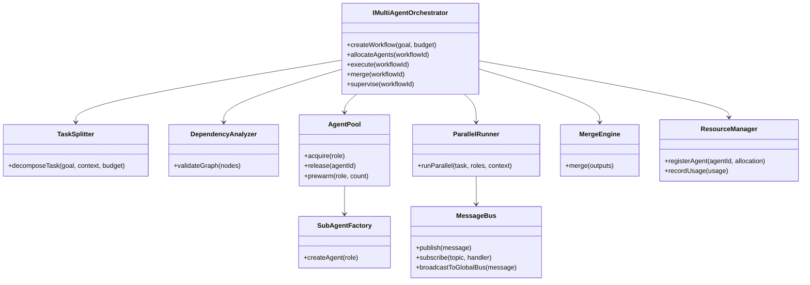
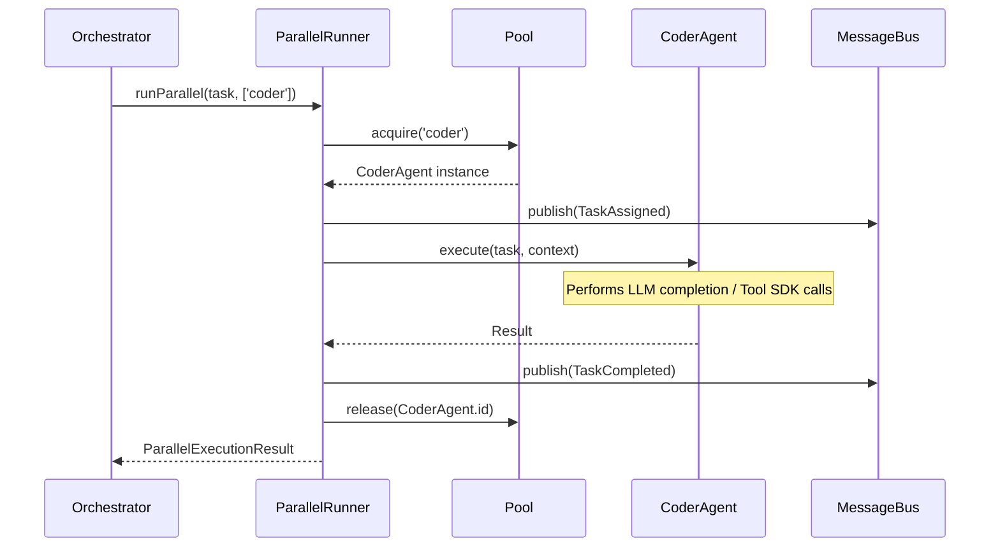

# Multi-Agent Orchestration Foundation (M3.0 Ext)

**Date:** 2026-07-14
**Status:** Completed

## 1. Multi-Agent Architecture Diagram

## 2. Parallel Execution Sequence Diagram

## 3. Flow Summaries

### Task Decomposition Flow

1. Receives natural language goal and budget.
2. Generates a Directed Acyclic Graph (DAG) of tasks representing independent units of work.
3. Each node contains resource estimates (CPU, Memory, Cost) and dependencies.
4. `DependencyAnalyzer` validates the DAG for missing links, duplicates, and cycles.

### Agent Pool Flow

1. Maintains separate idle lists by `AgentRole` (e.g., coder, reviewer).
2. Honors `minAgents` and `maxAgents`.
3. `prewarm` spins up instances before workflow execution begins.
4. `acquire` removes from idle or spawns a new one; `release` pushes it back to the idle list.

### Merge Engine Flow

1. Accepts array of results from sibling agents.
2. Deep merges JSON properties.
3. Uses `ConflictResolver` to break ties based on heuristic criteria (e.g., `coverageScore1 > coverageScore2` or `architectOverride`).

### Consensus Flow

1. Evaluates multiple votes for ambiguous states.
2. Supports `majority` (mode), `weighted` (roles carry varying importance), and `reviewerOverride` strategies.
3. Contains deterministic string sorting for tie-breaks.

### Heartbeat & Failure Recovery Flow

1. Agents emit status periodically (memory estimate, current state).
2. `HeartbeatMonitor` tracks last emission time.
3. Exceeding `timeoutMs` emits `heartbeat_lost`.
4. The `MultiAgentOrchestrator` catches the event, revokes the task from the dead agent, triggers the `RetryCoordinator`, and spawns a fresh sub-agent to preserve the workflow integrity.

### Resource Allocation Flow

1. Evaluates incoming agent requests against global `costCeilingUsd` and `tokenBudget`.
2. Registers active counts (providers, tools, CPU limits).
3. If limits are hit, throws `ResourceLimitExceededError` before the agent starts executing, protecting cloud costs.

## 4. Security & Isolation Considerations

- **No Shared Memory**: Agents do not share scope variables. Outputs are merged strictly via JSON representations.
- **Fail Closed**: Resource limits instantly throw exceptions aborting the execution pipeline if thresholds (tokens or costs) are exceeded.
- **Immutable Message Bus**: Internal events track the start, failure, and merging of tasks without exposing parent credentials.
- **Isolation Check**: Agent tasks run via the `ToolExecutionPipeline` relying on the previously vetted M2.1/M2.5 Approval Engine.

## 5. Scalability Considerations

- The internal Message Bus maps directly to `@agentx/core-runtime`'s `BullMQEventBus` wrapper (`broadcastToGlobalBus`), naturally supporting multi-node Kubernetes clustering architectures later in v1.0+.
- Idle agents can be configured with `idleTimeoutMs`, meaning they self-destruct gracefully to free application memory when workloads decline.
