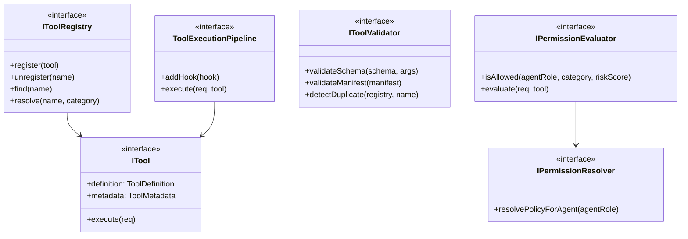
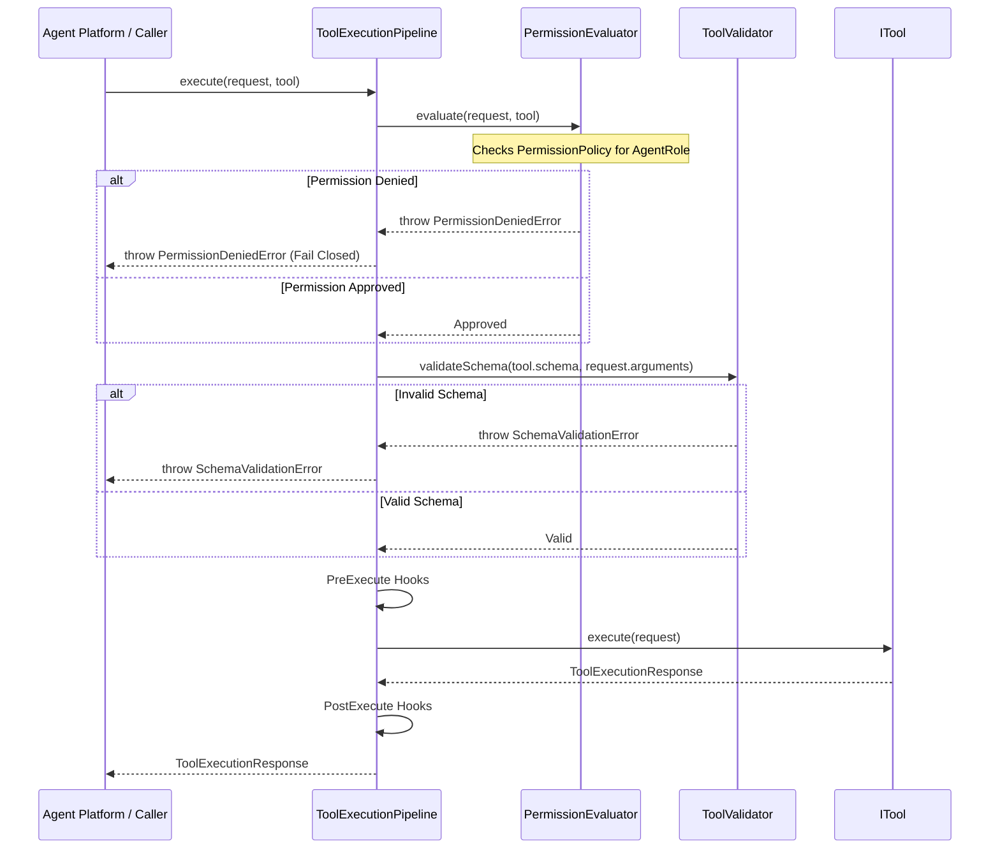

# Tool SDK Foundation (M2.1)

**Date:** 2026-07-14
**Status:** Completed

## 1. Architecture Diagram

## 2. Sequence Diagram (Tool Validation & Gating Flow)

## 3. Tool Registry Architecture

The `ToolRegistry` implements the `IToolRegistry` contract, serving as the central store for all registered tools. It:

- Validates that tool names are unique (throwing `DuplicateToolError`).
- Organizes tools by name and categorizes them to allow query optimization.
- Restricts resolution of a tool to cases where both the name and the requested `ToolCategory` match, preventing incorrect namespace invocation.

## 4. Permission Model

- **Graduated Roles**: Four built-in roles (`coding`, `review`, `test`, `security`) are defined with specific allowed categories matching Vol 7 Ch.2.
- **Evaluation**: The `PermissionEvaluator` performs checks on every request, comparing the caller's agent role against the tool category and risk score limits. Failures throw `PermissionDeniedError` before execution.

## 5. Tool Classification & Risk Management

Managed in `ToolClassifier`, every tool category resolves to a classification:

- **Destructive**: Enforces `Requires Approval` and risk scores of 90. Per ADR-0005, all `fs.write` calls, along with `shell.exec` and `git.write`, map unconditionally to this category.
- **PotentiallyDestructive**: Risk score of 50 (e.g. `shell.build`).
- **Safe**: Risk score of 10 (e.g. `fs.read`, `git.read`).

## 6. Validation Pipeline

Checks are layered at registration and invocation:

- **Manifest Check**: Verifies integrity of the manifest file properties (`entryPoint`, kinds, categories).
- **Duplicate Check**: Prevents registration of duplicate names.
- **Schema Check**: Validates execution arguments against the defined JSON schema parameters before execution.

## 7. Integration Points

- `@agentx/shared`: For metric counters and structured warning logging.
- `@agentx/secrets`: Decoupled; credentials are not stored or requested by the Tool SDK directly, conforming to Principle 3.
- `@agentx/core-runtime`: Execution context logs trace IDs cleanly.

## 8. Reference Mapping

- **Volume 7 (Tool SDK):** Strict permission check boundaries implemented.
- **ADR-0005 (fs.write destructive):** Implemented unconditionally in `ToolClassifier`.
- **RFC-0027 (Plugin sandboxing):** Manifest and validation schemas built.
